## Step 1)
- go 'Open or Create File' > 'Open File' and select pakchunk20-Android_ASTCClient.ucas


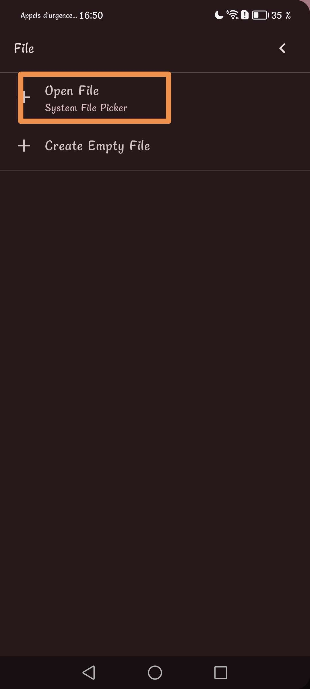

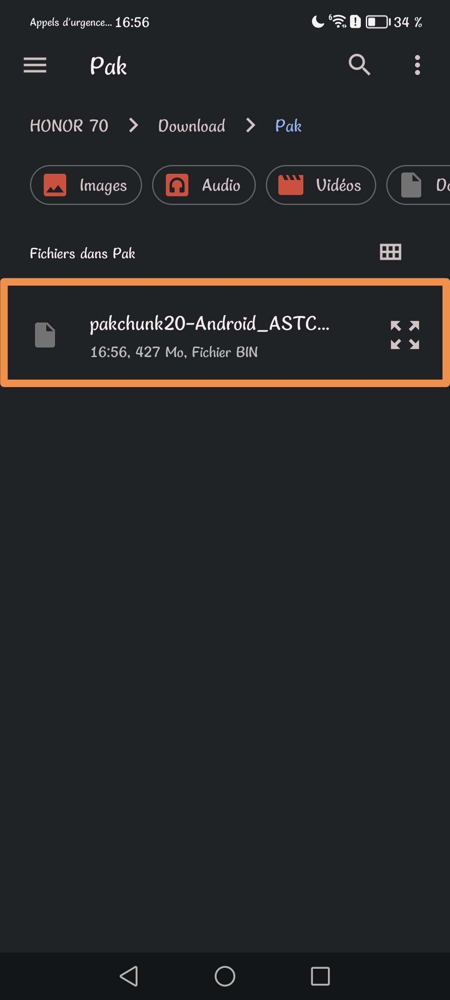

## Step 2)
- go 'Select Range' > First Address: ```010756D7``` > Last Address: ```01075D17``` and Select

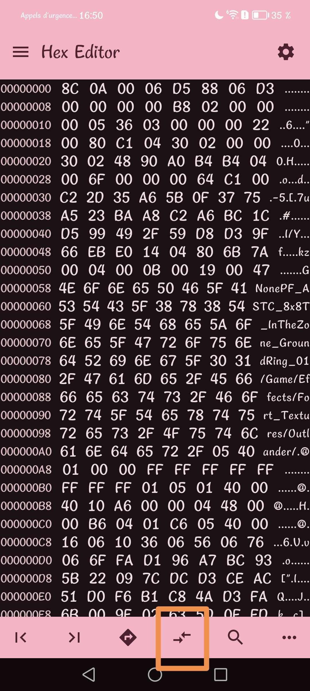

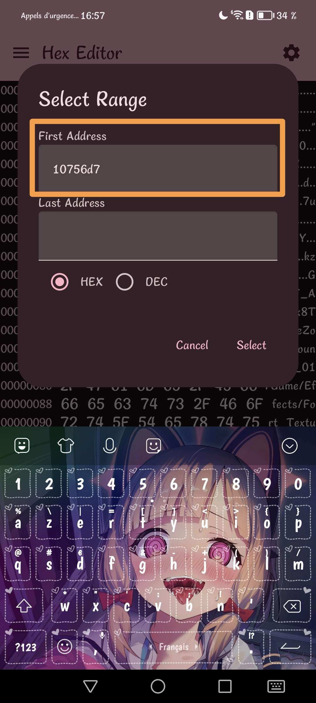

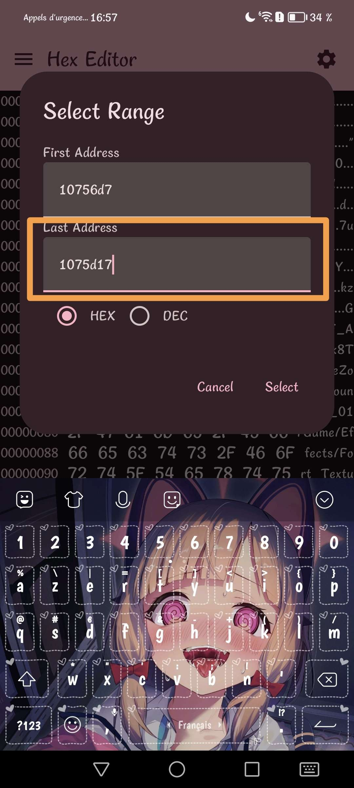

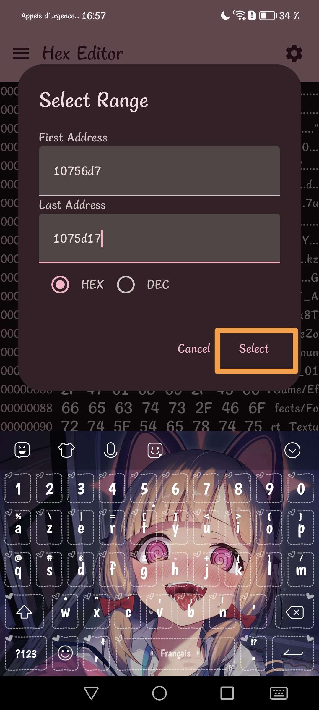

## Step 3)
- go 'Edit' > 'Fill Overwrite' > Don't change anything and Apply

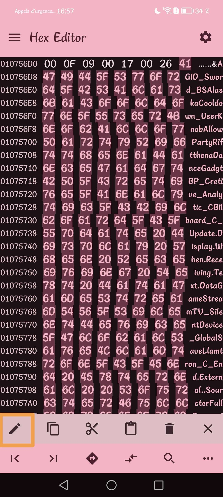

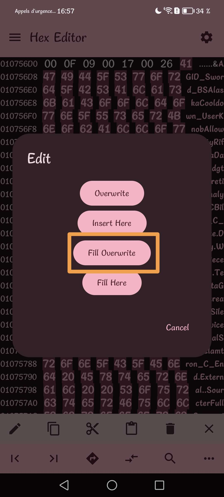

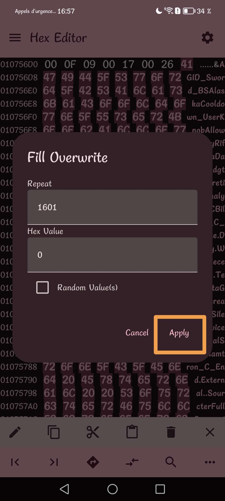

## Step 4)
- go to the top left and press the last save icon

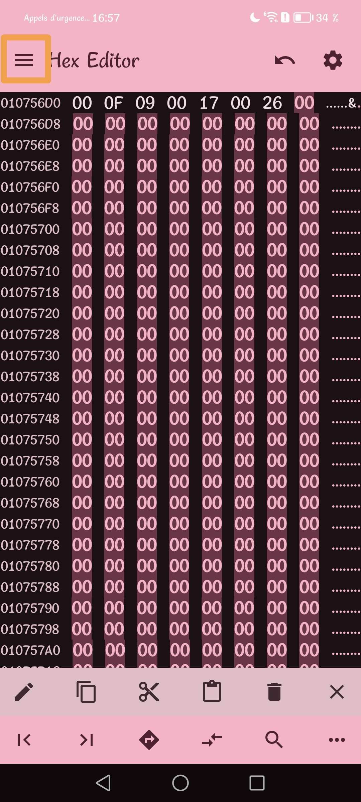

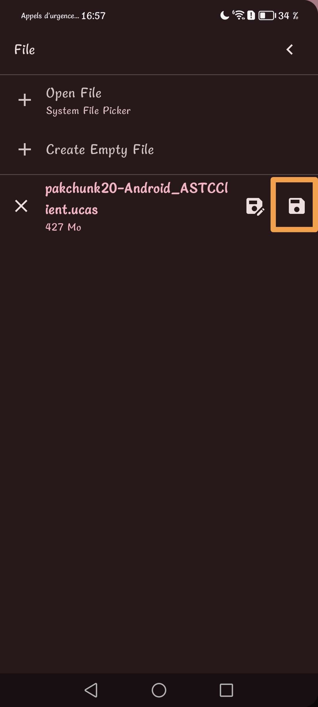