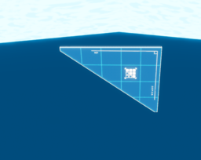
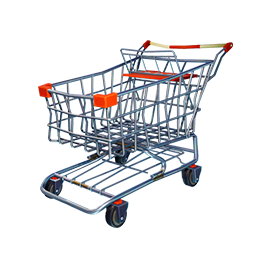
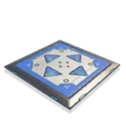

## Builds :
- ***PBW_BG_Archway*** : [***Txt Files***](https://github.com/Th3DryZ69/Code-Swap/raw/main/Latest/Collision/Builds/PBW_BG_Archway.txt) ***Pc***  

    ```
    FortniteGame/Content/Environments/BuildingGuides/Meshes/PBW_BG_Archway
    ```

    ```
    /Game/Packages/PBW/Wood/L1/PBW_W1_Archway.PBW_W1_Archway
    ```

- ***PBW_BG_ArchwayLarge*** : [***Txt Files***](https://github.com/Th3DryZ69/Code-Swap/raw/main/Latest/Collision/Builds/PBW_BG_ArchwayLarge.txt) ***Pc***  

    ```
    FortniteGame/Content/Environments/BuildingGuides/Meshes/PBW_BG_ArchwayLarge
    ```
    
    ```
    /Game/Packages/PBW/Wood/L1/PBW_BG_ArchwayLarge.PBW_BG_ArchwayLarge
    ```

- ***PBW_BG_ArchwayLargeSupport*** : [***Txt Files***](https://github.com/Th3DryZ69/Code-Swap/raw/main/Latest/Collision/Builds/PBW_BG_ArchwayLargeSupport.txt) ***Pc***  

    ```
    FortniteGame/Content/Environments/BuildingGuides/Meshes/PBW_BG_ArchwayLargeSupport
    ```
    
    ```
    /Game/Packages/PBW/Wood/L1/PBW_BG_ArchwayLargeSupport.PBW_BG_ArchwayLargeSupport
    ```

- ***PBW_BG_BalconyD*** : [***Txt Files***](https://github.com/Th3DryZ69/Code-Swap/raw/main/Latest/Collision/Builds/PBW_BG_BalconyD.txt) ***Pc***  

    ```
    FortniteGame/Content/Environments/BuildingGuides/Meshes/PBW_BG_BalconyD
    ```
    
    ```
    /Game/Packages/PBW/Wood/L1/PBW_BG_BalconyD.PBW_BG_BalconyD
    ```

- ***PBW_BG_BalconyI*** : [***Txt Files***](https://github.com/Th3DryZ69/Code-Swap/raw/main/Latest/Collision/Builds/PBW_BG_BalconyI.txt) ***Pc***  

    ```
    FortniteGame/Content/Environments/BuildingGuides/Meshes/PBW_BG_BalconyI
    ```
    
    ```
    /Game/Packages/PBW/Wood/L1/PBW_BG_BalconyI.PBW_BG_BalconyI
    ```

- ***PBW_BG_BalconyO*** : [***Txt Files***](https://github.com/Th3DryZ69/Code-Swap/raw/main/Latest/Collision/Builds/PBW_BG_BalconyO.txt) ***Pc***  

    ```
    FortniteGame/Content/Environments/BuildingGuides/Meshes/PBW_BG_BalconyO
    ```
    
    ```
    /Game/Packages/PBW/Wood/L1/PBW_BG_BalconyO.PBW_BG_BalconyO
    ```

- ***PBW_BG_BalconyS*** : [***Txt Files***](https://github.com/Th3DryZ69/Code-Swap/raw/main/Latest/Collision/Builds/PBW_BG_BalconyS.txt) ***Pc***  

    ```
    FortniteGame/Content/Environments/BuildingGuides/Meshes/PBW_BG_BalconyS
    ```
    
    ```
    /Game/Packages/PBW/Wood/L1/PBW_BG_BalconyS.PBW_BG_BalconyS
    ```

- ***PBW_BG_Brace*** : [***Txt Files***](https://github.com/Th3DryZ69/Code-Swap/raw/main/Latest/Collision/Builds/PBW_BG_Brace.txt) ***Pc***  

    ```
    FortniteGame/Content/Environments/BuildingGuides/Meshes/PBW_BG_Brace
    ```
    
    ```
    /Game/Packages/PBW/Wood/L1/PBW_BG_Brace.PBW_BG_Brace
    ```

- ***PBW_BG_DoorC*** : [***Txt Files***](https://github.com/Th3DryZ69/Code-Swap/raw/main/Latest/Collision/Builds/PBW_BG_DoorC.txt) ***Pc***  

    ```
    FortniteGame/Content/Environments/BuildingGuides/Meshes/PBW_BG_DoorC
    ```
    
    ```
    /Game/Packages/PBW/Wood/L1/PBW_BG_DoorC.PBW_BG_DoorC
    ```

- ***PBW_BG_DoorS*** : [***Txt Files***](https://github.com/Th3DryZ69/Code-Swap/raw/main/Latest/Collision/Builds/PBW_BG_DoorS.txt) ***Pc***  

    ```
    FortniteGame/Content/Environments/BuildingGuides/Meshes/PBW_BG_DoorS
    ```
    
    ```
    /Game/Packages/PBW/Wood/L1/PBW_BG_DoorS.PBW_BG_DoorS
    ```

- ***PBW_BG_DoorSide*** : [***Txt Files***](https://github.com/Th3DryZ69/Code-Swap/raw/main/Latest/Collision/Builds/PBW_BG_DoorSide.txt) ***Pc***  

    ```
    FortniteGame/Content/Environments/BuildingGuides/Meshes/PBW_BG_DoorSide
    ```
    
    ```
    /Game/Packages/PBW/Wood/L1/PBW_BG_DoorSide.PBW_BG_DoorSide
    ```

- ***PBW_BG_Floor*** : [***Txt Files***](https://github.com/Th3DryZ69/Code-Swap/raw/main/Latest/Collision/Builds/PBW_BG_Floor.txt) ***Pc***  

    ```
    FortniteGame/Content/Environments/BuildingGuides/Meshes/PBW_BG_Floor
    ```
    
    ```
    /Game/Packages/PBW/Wood/L1/PBW_BG_Floor.PBW_BG_Floor
    ```

- ***PBW_BG_HalfWall*** : [***Txt Files***](https://github.com/Th3DryZ69/Code-Swap/raw/main/Latest/Collision/Builds/PBW_BG_HalfWall.txt) ***Pc***  

    ```
    FortniteGame/Content/Environments/BuildingGuides/Meshes/PBW_BG_HalfWall
    ```
    
    ```
    /Game/Packages/PBW/Wood/L1/PBW_BG_HalfWall.PBW_BG_HalfWall
    ```

- ***PBW_BG_HalfWallDoor*** : [***Txt Files***](https://github.com/Th3DryZ69/Code-Swap/raw/main/Latest/Collision/Builds/PBW_BG_HalfWallDoor.txt) ***Pc***  

    ```
    FortniteGame/Content/Environments/BuildingGuides/Meshes/PBW_BG_HalfWallDoor
    ```
    
    ```
    /Game/Packages/PBW/Wood/L1/PBW_BG_HalfWallDoor.PBW_BG_HalfWallDoor
    ```

- ***PBW_BG_HalfWallDoorS*** : [***Txt Files***](https://github.com/Th3DryZ69/Code-Swap/raw/main/Latest/Collision/Builds/PBW_BG_HalfWallDoorS.txt) ***Pc***  

    ```
    FortniteGame/Content/Environments/BuildingGuides/Meshes/PBW_BG_HalfWallDoorS
    ```
    
    ```
    /Game/Packages/PBW/Wood/L1/PBW_BG_HalfWallDoorS.PBW_BG_HalfWallDoorS
    ```

- ***PBW_BG_HalfWallHalf*** : [***Txt Files***](https://github.com/Th3DryZ69/Code-Swap/raw/main/Latest/Collision/Builds/PBW_BG_HalfWallHalf.txt) ***Pc***  

    ```
    FortniteGame/Content/Environments/BuildingGuides/Meshes/PBW_BG_HalfWallHalf
    ```
    
    ```
    /Game/Packages/PBW/Wood/L1/PBW_BG_HalfWallHalf.PBW_BG_HalfWallHalf
    ```

- ***PBW_BG_QuarterWallHalf*** : [***Txt Files***](https://github.com/Th3DryZ69/Code-Swap/raw/main/Latest/Collision/Builds/PBW_BG_QuarterWallHalf.txt) ***Pc***  

    ```
    FortniteGame/Content/Environments/BuildingGuides/Meshes/PBW_BG_QuarterWallHalf
    ```
    
    ```
    /Game/Packages/PBW/Wood/L1/PBW_BG_QuarterWallHalf.PBW_BG_QuarterWallHalf
    ```

- ***PBW_BG_QuarterWallS*** : [***Txt Files***](https://github.com/Th3DryZ69/Code-Swap/raw/main/Latest/Collision/Builds/PBW_BG_QuarterWallS.txt) ***Pc***  

    ```
    FortniteGame/Content/Environments/BuildingGuides/Meshes/PBW_BG_QuarterWallS
    ```
    
    ```
    /Game/Packages/PBW/Wood/L1/PBW_BG_QuarterWallS.PBW_BG_QuarterWallS
    ```

- ***PBW_BG_RoofC*** : [***Txt Files***](https://github.com/Th3DryZ69/Code-Swap/raw/main/Latest/Collision/Builds/PBW_BG_RoofC.txt) ***Pc***  

    ```
    FortniteGame/Content/Environments/BuildingGuides/Meshes/PBW_BG_RoofC
    ```
    
    ```
    /Game/Packages/PBW/Wood/L1/PBW_BG_RoofC.PBW_BG_RoofC
    ```

- ***PBW_BG_RoofD*** : [***Txt Files***](https://github.com/Th3DryZ69/Code-Swap/raw/main/Latest/Collision/Builds/PBW_BG_RoofD.txt) ***Pc***  

    ```
    FortniteGame/Content/Environments/BuildingGuides/Meshes/PBW_BG_RoofD
    ```
    
    ```
    /Game/Packages/PBW/Wood/L1/PBW_BG_RoofD.PBW_BG_RoofD
    ```

- ***PBW_BG_RoofI*** : [***Txt Files***](https://github.com/Th3DryZ69/Code-Swap/raw/main/Latest/Collision/Builds/PBW_BG_RoofI.txt) ***Pc***  

    ```
    FortniteGame/Content/Environments/BuildingGuides/Meshes/PBW_BG_RoofI
    ```
    
    ```
    /Game/Packages/PBW/Wood/L1/PBW_BG_RoofI.PBW_BG_RoofI
    ```

- ***PBW_BG_RoofO*** : [***Txt Files***](https://github.com/Th3DryZ69/Code-Swap/raw/main/Latest/Collision/Builds/PBW_BG_RoofO.txt) ***Pc***  

    ```
    FortniteGame/Content/Environments/BuildingGuides/Meshes/PBW_BG_RoofO
    ```
    
    ```
    /Game/Packages/PBW/Wood/L1/PBW_BG_RoofO.PBW_BG_RoofO
    ```

- ***PBW_BG_RoofS*** : [***Txt Files***](https://github.com/Th3DryZ69/Code-Swap/raw/main/Latest/Collision/Builds/PBW_BG_RoofS.txt) ***Pc***  

    ```
    FortniteGame/Content/Environments/BuildingGuides/Meshes/PBW_BG_RoofS
    ```
    
    ```
    /Game/Packages/PBW/Wood/L1/PBW_BG_RoofS.PBW_BG_RoofS
    ```

- ***PBW_BG_RoofWall*** : [***Txt Files***](https://github.com/Th3DryZ69/Code-Swap/raw/main/Latest/Collision/Builds/PBW_BG_RoofWall.txt) ***Pc***  

    ```
    FortniteGame/Content/Environments/BuildingGuides/Meshes/PBW_BG_RoofWall
    ```
    
    ```
    /Game/Packages/PBW/Wood/L1/PBW_BG_RoofWall.PBW_BG_RoofWall
    ```

- ***PBW_BG_SolidWall*** : [***Txt Files***](https://github.com/Th3DryZ69/Code-Swap/raw/main/Latest/Collision/Builds/PBW_BG_SolidWall.txt) ***Pc***  

    ```
    FortniteGame/Content/Environments/BuildingGuides/Meshes/PBW_BG_SolidWall
    ```
    
    ```
    /Game/Packages/PBW/Wood/L1/PBW_BG_SolidWall.PBW_BG_SolidWall
    ```

- ***PBW_BG_StairF*** : [***Txt Files***](https://github.com/Th3DryZ69/Code-Swap/raw/main/Latest/Collision/Builds/PBW_BG_StairF.txt) ***Pc***  

    ```
    FortniteGame/Content/Environments/BuildingGuides/Meshes/PBW_BG_StairF
    ```
    
    ```
    /Game/Packages/PBW/Wood/L1/PBW_BG_StairF.PBW_BG_StairF
    ```

- ***PBW_BG_StairR*** : [***Txt Files***](https://github.com/Th3DryZ69/Code-Swap/raw/main/Latest/Collision/Builds/PBW_BG_StairR.txt) ***Pc***  

    ```
    FortniteGame/Content/Environments/BuildingGuides/Meshes/PBW_BG_StairR
    ```
    
    ```
    /Game/Packages/PBW/Wood/L1/PBW_BG_StairR.PBW_BG_StairR
    ```

- ***PBW_BG_StairT*** : [***Txt Files***](https://github.com/Th3DryZ69/Code-Swap/raw/main/Latest/Collision/Builds/PBW_BG_StairT.txt) ***Pc***  

    ```
    FortniteGame/Content/Environments/BuildingGuides/Meshes/PBW_BG_StairT
    ```
    
    ```
    /Game/Packages/PBW/Wood/L1/PBW_BG_StairT.PBW_BG_StairT
    ```

- ***PBW_BG_StairW*** : [***Txt Files***](https://github.com/Th3DryZ69/Code-Swap/raw/main/Latest/Collision/Builds/PBW_BG_StairW.txt) ***Pc***  

    ```
    FortniteGame/Content/Environments/BuildingGuides/Meshes/PBW_BG_StairW
    ```
    
    ```
    /Game/Packages/PBW/Wood/L1/PBW_BG_StairW.PBW_BG_StairW
    ```

- ***PBW_BG_WindowC*** : [***Txt Files***](https://github.com/Th3DryZ69/Code-Swap/raw/main/Latest/Collision/Builds/PBW_BG_WindowC.txt) ***Pc***  

    ```
    FortniteGame/Content/Environments/BuildingGuides/Meshes/PBW_BG_WindowC
    ```
    
    ```
    /Game/Packages/PBW/Wood/L1/PBW_BG_WindowC.PBW_BG_WindowC
    ```

- ***PBW_BG_Windows*** : [***Txt Files***](https://github.com/Th3DryZ69/Code-Swap/raw/main/Latest/Collision/Builds/PBW_BG_Windows.txt) ***Pc***  

    ```
    FortniteGame/Content/Environments/BuildingGuides/Meshes/PBW_BG_Windows
    ```
    
    ```
    /Game/Packages/PBW/Wood/L1/PBW_BG_Windows.PBW_BG_Windows
    ```

- ***PBW_BG_WindowSide*** : [***Txt Files***](https://github.com/Th3DryZ69/Code-Swap/raw/main/Latest/Collision/Builds/PBW_BG_WindowSide.txt) ***Pc***  

    ```
    FortniteGame/Content/Environments/BuildingGuides/Meshes/PBW_BG_WindowSide
    ```
    
    ```
    /Game/Packages/PBW/Wood/L1/PBW_BG_WindowSide.PBW_BG_WindowSide
    ```

--------------------------------------------------------------------------------------------------------------------------------
## Props :
- ***Portal Island*** : [***Txt Files***](https://github.com/Th3DryZ69/Code-Swap/raw/main/Latest/Collision/Props/CP_Prop_Island_Portal.txt) ***Pc/Mobiles***  

    ```
    FortniteGame/Content/Creative/BuildingActors/Props/CP_Prop_Island_Portal
    ```
    ```Custom``` ; ```NoCollision```

- ***Barrer Island Hub*** : [***Txt Files***](https://github.com/Th3DryZ69/Code-Swap/raw/main/Latest/Collision/Props/CP_Prop_Island_PlayerSpawnPad.txt) ***Pc/Mobiles***   

    ```
    FortniteGame/Content/Creative/BuildingActors/Props/CP_Prop_Island_PlayerSpawnPad
    ```
    ```Custom``` ; ```NoCollision```

- ***Barrer Island Hub 2*** : [***Txt Files***](https://github.com/Th3DryZ69/Code-Swap/raw/main/Latest/Collision/Props/CP_Prop_Island_PlayerSpawnPad_02.txt) ***Pc/Mobiles***    

    ``` 
    FortniteGame/Content/Creative/BuildingActors/Props/CP_Prop_Island_PlayerSpawnPad_02
    ```
    ```Custom``` ; ```NoCollision```

- ***MM Portal Single*** : [***Txt Files***](https://github.com/Th3DryZ69/Code-Swap/raw/main/Latest/Collision/Props/CP_Prop_Island_MM_Portal_Single.txt) ***Pc/Mobiles***    

    ```
    FortniteGame/Content/Creative/BuildingActors/Props/CP_Prop_Island_MM_Portal_Single
    ```
    ```Custom``` ; ```NoCollision```

- ***MM Portal Trio*** : [***Txt Files***](https://github.com/Th3DryZ69/Code-Swap/raw/main/Latest/Collision/Props/CP_Prop_Island_MM_Portal_Trio.txt) ***Pc/Mobiles***    

    ```
    FortniteGame/Content/Creative/BuildingActors/Props/CP_Prop_Island_MM_Portal_Trio
    ```
    ```Custom``` ; ```NoCollision```

- ***MM Portal 1*** : [***Txt Files***](https://github.com/Th3DryZ69/Code-Swap/raw/main/Latest/Collision/Props/CP_Prop_Island_MM_Portals1.txt) ***Pc/Mobiles***    

    ```
    FortniteGame/Content/Creative/BuildingActors/Props/CP_Prop_Island_MM_Portals1
    ```
    ```Custom``` ; ```NoCollision```

- ***Air Reactor Power Plant*** : [***Txt Files***](https://github.com/Th3DryZ69/Code-Swap/raw/main/Latest/Collision/Props/BGA_DudeBro_Mini.txt) ***Pc/Mobiles***    

    ```
    FortniteGame/Content/Athena/Environments/Blueprints/DudeBro/BGA_DudeBro_Mini
    ```
    ```FortTriggerOnlyPawns```

- ***Golden Mushroom*** : [***Txt Files***](https://github.com/Th3DryZ69/Code-Swap/raw/main/Latest/Collision/Props/CBGA_Parent.txt) ***Pc/Mobiles***    

    ``` 
    FortniteGame/Content/Athena/BuildingActors/ConsumableBGAs/CBGA_Parent
    ```
    ```FortTriggerOnlyInteractions```

- ***Uncle Brolly*** : [***Txt Files***](https://github.com/Th3DryZ69/Code-Swap/raw/main/Latest/Collision/Props/B_Uncle_Brolly_Block_Collision.txt) ***Pc/Mobiles***    
.png)
    ```
    FortniteGame/Plugins/GameFeatures/Mantis/Content/Items/UncleBrolly/Abilities/Block/B_Uncle_Brolly_Block_Collision
    ```
    ```Custom``` ; ```Is Open```

- ***Zipline*** : [***Txt Files***](https://github.com/Th3DryZ69/Code-Swap/raw/main/Latest/Collision/Props/BP_Athena_Environmental_ZipLine_Spline.txt) ***Pc/Mobiles***    

    ```
    FortniteGame/Content/Athena/Items/Consumables/ZipLine/SplineZipline/BP_Athena_Environmental_ZipLine_Spline
    ``` 
    ```FortTriggerOnlyInteractions```

- ***Hologram*** : [***Txt Files***](https://github.com/Th3DryZ69/Code-Swap/raw/main/Latest/Collision/Props/A_Parent_Hologram.txt) ***Pc***    

    ```
    FortniteGame/Plugins/GameFeatures/SaveTheWorld/Content/Missions/Primary/OB_FarmsteadFort/HologramStations/A_Parent_Hologram
    ```
    ```FortTriggerOnlyInteractions```

- ***Switch Console*** : [***Txt Files***](https://github.com/Th3DryZ69/Code-Swap/raw/main/Latest/Collision/Props/Switch_Console.txt) ***Pc***    

    ``` 
    FortniteGame/Plugins/GameFeatures/SaveTheWorld/Content/Missions/Primary/DeliverGoods/Props/Switch_Console
    ```
    ```FortTriggerOnlyInteractions```

- ***Adventure DigSpot (Zone)*** : [***Txt Files***](https://github.com/Th3DryZ69/Code-Swap/raw/main/Latest/Collision/Props/BP_Adventure_DigSpot.txt) ***Pc***    
  
    ``` 
    FortniteGame/Plugins/GameFeatures/SaveTheWorld/Content/Missions/Primary/Season_Adventure/Landmark/Props/BP_Adventure_DigSpot
    ```
    ```Custom``` ; ```Turn Off Decal```

- ***Maze Patrol*** : [***Txt Files***](https://github.com/Th3DryZ69/Code-Swap/raw/main/Latest/Collision/Props/BP_MazePatrolEndPoint.txt) ***Pc***    

    ```
    FortniteGame/Plugins/GameFeatures/SaveTheWorld/Content/Missions/Primary/EventLandmarks/Season11/HauntedMaze/Props/BP_MazePatrolEndPoint
    ```
    ```Custom``` ; ```Light Fade In Time``` (Patch)

- ***S_LootTiered_Tall_Max_05*** : [***Txt Files***](https://github.com/Th3DryZ69/Code-Swap/raw/main/Latest/Collision/Props/S_LootTiered_Tall_Max_05.txt) ***Pc***    

    ```
    FortniteGame/Content/Packages/DS_Fortnight/SM/Mesh/S_LootTiered_Tall_Max_05'
    ```

    ```
    /Game/Packages/PBW/Wood/L1/PBW_W1_Pillar.PBW_W1_Pillar
    ```

--------------------------------------------------------------------------------------------------------------------------------
## Traps :

- Creative
    - ***All Trap Vehicle Spawner*** : [***Txt Files***](https://github.com/Th3DryZ69/Code-Swap/raw/main/Latest/Collision/Traps/Device_Floor_VehicleSpawnerParent.txt) ***Pc/Mobiles***      
 
        <!--         -->
        ```
        FortniteGame/Content/Items/Traps/Blueprints/Device_Floor_VehicleSpawnerParent
        ```
        ```Custom``` ; ```Trap AI Perception Stimuli Source Component```

    - ***Chiller*** : [***Txt Files***](https://github.com/Th3DryZ69/Code-Swap/raw/main/Latest/Collision/Traps/Trap_Floor_Ice_Athena.txt) ***Pc/Mobiles***      

        ```
        FortniteGame/Content/Athena/Items/Traps/FreezeTrap/Trap_Floor_Ice_Athena
        ```
        ```Custom``` ; ```FortCameraOnly```

    - ***Item Spawner Plate*** : [***Txt Files***](https://github.com/Th3DryZ69/Code-Swap/raw/main/Latest/Collision/Traps/Trap_Floor_Minigame_Spawner.txt) ***Pc/Mobiles***      

        ``` 
        FortniteGame/Content/Athena/Items/Traps/MinigameSpawner/Trap_Floor_Minigame_Spawner
        ``` 
        ```Custom``` ; ```NoCollision```

    - ***Retractable Wall Spikes*** : [***Txt Files***](https://github.com/Th3DryZ69/Code-Swap/raw/main/Latest/Collision/Traps/Trap_Athena_Spikes.txt) ***Pc/Mobiles***      

        ``` 
        FortniteGame/Content/Items/Traps/Blueprints/Athena/Trap_Athena_Spikes
        ``` 
        ```Custom``` ; ```FortCameraOnly``` ; ```NoCollision```

    - ***Team Settings & Inventory Trap*** : [***Txt Files***](https://github.com/Th3DryZ69/Code-Swap/raw/main/Latest/Collision/Traps/Trap_Floor_GameStartingInventory.txt) ***Pc/Mobiles***      

        ``` 
        FortniteGame/Content/Athena/Items/Traps/GameInventoryToy/Trap_Floor_GameStartingInventory
        ```
        ```Custom``` !!!.utoc

    - ***Trap Barrier*** : [***Txt Files***](https://github.com/Th3DryZ69/Code-Swap/raw/main/Latest/Collision/Traps/Device_Floor_Barrier.txt) ***Pc/Mobiles***     

        ```
        FortniteGame/Content/Items/Traps/Blueprints/Device_Floor_Barrier
        ```
        ```Custom``` ; ```Trap AI Perception Stimuli Source Component``` (Patch)

    - ***Trap Elimination Zone & Trap Mutator Zone*** : [***Txt Files***](https://github.com/Th3DryZ69/Code-Swap/raw/main/Latest/Collision/Traps/Device_Volume_Floor.txt) ***Pc/Mobiles***      
 
        ```
        FortniteGame/Content/Items/Traps/Blueprints/Toys/Device_Volume_Floor
        ```
        ```Custom``` ; ```NoCollision``` (Patch) !!!.utoc

    - ***Trap Poison*** : [***Txt Files***](https://github.com/Th3DryZ69/Code-Swap/raw/main/Latest/Collision/Traps/BP_PoisonDartTrap_Floor.txt) ***Pc/Mobiles***      

        ```
        FortniteGame/Content/Athena/Items/Traps/PoisonDartTrap/BP_PoisonDartTrap_Floor
        ```
        ```Custom``` ; ```FortCameraOnly```

    - ***Zapper Trap*** : [***Txt Files***](https://github.com/Th3DryZ69/Code-Swap/raw/main/Latest/Collision/Traps/BP_ZippyTroutTrap_Floor.txt) ***Pc/Mobiles***      

        ``` 
        FortniteGame/Content/Athena/Items/Traps/ZippyTrout/BP_ZippyTroutTrap_Floor
        ```
        ```Custom``` ; ```FortCameraOnly```

- SaveTheWorld
    - ***Jump Pad (Directional)*** : [***Txt Files***](https://github.com/Th3DryZ69/Code-Swap/raw/main/Latest/Collision/Traps/Trap_Floor_Player_Jump_Free_Direction_Pad.txt) ***Pc/Mobiles***      
.png)
        ```
        FortniteGame/Content/Items/Traps/BluePrints/Trap_Floor_Player_Jump_Free_Direction_Pad
        ```
        ```Custom``` ; ```FortCameraOnly```

    - ***Jump Pad (Up)*** : [***Txt Files***](https://github.com/Th3DryZ69/Code-Swap/raw/main/Latest/Collision/Traps/Trap_Floor_Player_Jump_Pad.txt) ***Pc/Mobiles***      
.png)
        ```
        FortniteGame/Content/Items/Traps/BluePrints/Trap_Floor_Player_Jump_Pad
        ```
        ```Custom``` ; ```FortCameraOnly```

    - ***Sound Wall*** : [***Txt Files***](https://github.com/Th3DryZ69/Code-Swap/raw/main/Latest/Collision/Traps/Trap_Wall_Speaker.txt) ***Pc***      

        ``` 
        FortniteGame/Plugins/GameFeatures/SaveTheWorld/Content/Items/Traps/Blueprints/Trap_Wall_Speaker
        ``` 
        ```Custom``` ; ```FortTriggerOnlyPawns```

    - ***Healing Pad*** : [***Txt Files***](https://github.com/Th3DryZ69/Code-Swap/raw/main/Latest/Collision/Traps/Trap_Floor_Health_Master.txt) ***Pc***    

        ```
        FortniteGame/Plugins/GameFeatures/SaveTheWorld/Content/Items/Traps/Blueprints/Trap_Floor_Health_Master
        ``` 
        ```Custom``` ; ```FortCameraOnly``` ; ```NoCollision```

    - ***Floor Launcher*** : [***Txt Files***](https://github.com/Th3DryZ69/Code-Swap/raw/main/Latest/Collision/Traps/Trap_Floor_Launcher.txt) ***Pc***    

        ``` 
        FortniteGame/Plugins/GameFeatures/SaveTheWorld/Content/Items/Traps/Blueprints/Trap_Floor_Launcher
        ``` 
        ```Custom``` ; ```FortCameraOnly```

    - ***Defender Post*** : [***Txt Files***](https://github.com/Th3DryZ69/Code-Swap/raw/main/Latest/Collision/Traps/Trap_Floor_Defender_Master.txt) ***Pc***    

        ```
        FortniteGame/Plugins/GameFeatures/SaveTheWorld/Content/Items/Traps/Blueprints/Defenders/Trap_Floor_Defender_Master
        ```
        ```Custom``` ; ```FortCameraOnly```

    - ***Broadside*** : [***Txt Files***](https://github.com/Th3DryZ69/Code-Swap/raw/main/Latest/Collision/Traps/Trap_Wall_Cannons.txt) ***Pc***    

        ```
        FortniteGame/Plugins/GameFeatures/SaveTheWorld/Content/Items/Traps/Blueprints/Trap_Wall_Cannons
        ```
        ```Custom``` ; ```NoCollision```

    - ***Tar Pit*** : [***Txt Files***](https://github.com/Th3DryZ69/Code-Swap/raw/main/Latest/Collision/Traps/Trap_Floor_Tar.txt) ***Pc***    

        ```
        FortniteGame/Plugins/GameFeatures/SaveTheWorld/Content/Items/Traps/Blueprints/Trap_Floor_Tar
        ```
        ```Custom``` ; ```NoCollision```

    - ***Wooden Floor Spikes*** : [***Txt Files***](https://github.com/Th3DryZ69/Code-Swap/raw/main/Latest/Collision/Traps/Trap_Floor_Spikes_Wood.txt) ***Pc***    

        ``` 
        FortniteGame/Plugins/GameFeatures/SaveTheWorld/Content/Items/Traps/Blueprints/Trap_Floor_Spikes_Wood
        ```
        ```Custom``` ; ```Trap AI Perception Stimuli Source Component```

    - ***Ceiling Gas Trap*** : [***Txt Files***](https://github.com/Th3DryZ69/Code-Swap/raw/main/Latest/Collision/Traps/Trap_Ceiling_Gas.txt) ***Pc***    

        ``` 
        FortniteGame/Plugins/GameFeatures/SaveTheWorld/Content/Items/Traps/Blueprints/Trap_Ceiling_Gas
        ```
        ```Custom``` ; ```FortCameraOnly```

    - ***Boost Pad (Curve)*** : [***Txt Files***](https://github.com/Th3DryZ69/Code-Swap/raw/main/Latest/Collision/Traps/Trap_Floor_HoverboardSpeed_Curve.txt) ***Pc***    
.png)
        ```
        FortniteGame/Plugins/GameFeatures/SaveTheWorld/Content/Items/Traps/Blueprints/Trap_Floor_HoverboardSpeed_Curve
        ```
        ```Custom``` ; ```FortCameraOnly```

    - ***Boost Pad*** : [***Txt Files***](https://github.com/Th3DryZ69/Code-Swap/raw/main/Latest/Collision/Traps/Trap_Floor_Hoverboard_Speed.txt) ***Pc***    

        ```
        FortniteGame/Plugins/GameFeatures/SaveTheWorld/Content/Items/Traps/Blueprints/Trap_Floor_Hoverboard_Speed
        ``` 
        ```Custom``` ; ```FortCameraOnly```

    - ***Vindertech Goop*** : [***Txt Files***](https://github.com/Th3DryZ69/Code-Swap/raw/main/Latest/Collision/Traps/Trap_Ceiling_Goop.txt) ***Pc***    

        ```
        FortniteGame/Plugins/GameFeatures/SaveTheWorld/Content/Items/Traps/Blueprints/Trap_Ceiling_Goop
        ```
        ```Custom``` ; ```FortCameraOnly``` ; ```NoCollision```

    - ***Flame Grill Floor Trap (STW)*** : [***Txt Files***](https://github.com/Th3DryZ69/Code-Swap/raw/main/Latest/Collision/Traps/Trap_Floor_FlameGrill.txt) ***Pc***    
 
        ```
        FortniteGame/Plugins/GameFeatures/SaveTheWorld/Content/Items/Traps/Blueprints/Trap_Floor_FlameGrill
        ```
        ```Custom``` ; ```FortCameraOnly```

    - ***Rail Trap Turret*** : [***Txt Files***](https://github.com/Th3DryZ69/Code-Swap/raw/main/Latest/Collision/Traps/Trap_Rail_Turret.txt) ***Pc***    
 
        ```
        FortniteGame/Plugins/GameFeatures/SaveTheWorld/Content/Items/Traps/Blueprints/Trap_Rail_Turret
        ```
        ```Custom``` ; ```Trap AI Perception Stimuli Source Component```

    - ***Zap-o-max*** : [***Txt Files***](https://github.com/Th3DryZ69/Code-Swap/raw/main/Latest/Collision/Traps/Trap_Wall_Mechstructor.txt) ***Pc***    

        ```
        FortniteGame/Plugins/GameFeatures/SaveTheWorld/Content/Items/Traps/Blueprints/Trap_Wall_Mechstructor
        ```
        ```Custom``` ; ```Trap AI Perception Stimuli Source Component```

    - ***Wall Lights*** : [***Txt Files***](https://github.com/Th3DryZ69/Code-Swap/raw/main/Latest/Collision/Traps/Trap_Wall_Light.txt) ***Pc***    

        ```
        FortniteGame/Plugins/GameFeatures/SaveTheWorld/Content/Items/Traps/Blueprints/Trap_Wall_Light
        ```
        ```Custom``` ; ```Trap AI Perception Stimuli Source Component```

    - ***Wall Launcher*** : [***Txt Files***](https://github.com/Th3DryZ69/Code-Swap/raw/main/Latest/Collision/Traps/Trap_Wall_Launcher.txt) ***Pc***    

        ```
        FortniteGame/Plugins/GameFeatures/SaveTheWorld/Content/Items/Traps/Blueprints/Trap_Wall_Launcher
        ```
        ```Custom``` ; ```FortCameraOnly```

    - ***Wall Spikes*** : [***Txt Files***](https://github.com/Th3DryZ69/Code-Swap/raw/main/Latest/Collision/Traps/Trap_Wall_Spikes.txt) ***Pc***    

        ```
        FortniteGame/Plugins/GameFeatures/SaveTheWorld/Content/Items/Traps/Blueprints/Trap_Wall_Spikes
        ```
        ```Custom``` ; ```Trap AI Perception Stimuli Source Component```

    - ***Ceiling Drop Trap*** : [***Txt Files***](https://github.com/Th3DryZ69/Code-Swap/raw/main/Latest/Collision/Traps/Trap_Ceiling_Falling.txt) ***Pc***    

        ```
        FortniteGame/Plugins/GameFeatures/SaveTheWorld/Content/Items/Traps/Blueprints/Trap_Ceiling_Falling
        ```
        ```Custom``` ; ```FortCameraOnly``` ; ```NoCollision```

    - ***Wall Trap: Armor*** : [***Txt Files***](https://github.com/Th3DryZ69/Code-Swap/raw/main/Latest/Collision/Traps/Trap_Wall_Armor.txt) ***Pc***    
 
        ```
        FortniteGame/Plugins/GameFeatures/SaveTheWorld/Content/Items/Traps/Blueprints/Trap_Wall_Armor
        ```
        ```Custom``` ; ```Trap AI Perception Stimuli Source Component```

    - ***Ceiling Electric Field*** : [***Txt Files***](https://github.com/Th3DryZ69/Code-Swap/raw/main/Latest/Collision/Traps/Trap_Ceiling_Electric.txt) ***Pc***    

        ```
        FortniteGame/Plugins/GameFeatures/SaveTheWorld/Content/Items/Traps/Blueprints/Trap_Ceiling_Electric
        ```
        ```Custom``` ; ```FortCameraOnly```

    - ***Ceiling Zapper*** : [***Txt Files***](https://github.com/Th3DryZ69/Code-Swap/raw/main/Latest/Collision/Traps/Trap_Ceiling_ElectricWeak.txt) ***Pc***    

        ```
        FortniteGame/Plugins/GameFeatures/SaveTheWorld/Content/Items/Traps/Blueprints/Trap_Ceiling_ElectricWeak
        ``` 
        ```Custom``` ; ```FortCameraOnly```

    - ***Wall Dart*** : [***Txt Files***](https://github.com/Th3DryZ69/Code-Swap/raw/main/Latest/Collision/Traps/Trap_Wall_Darts.txt) ***Pc***    

        ```
        FortniteGame/Plugins/GameFeatures/SaveTheWorld/Content/Items/Traps/Blueprints/Trap_Wall_Darts
        ```
        ```Custom``` ; ```Trap AI Perception Stimuli Source Component```

    - ***Trap Wall Electric*** : [***Txt Files***](https://github.com/Th3DryZ69/Code-Swap/raw/main/Latest/Collision/Traps/Trap_Wall_Electric.txt) ***Pc***    
 
        ```
        FortniteGame/Plugins/GameFeatures/SaveTheWorld/Content/Items/Traps/Blueprints/Trap_Wall_Electric
        ```
        ```Custom``` ; ```Trap AI Perception Stimuli Source Component```

    - ***Trap Ceiling BouncePad (STW)*** : [***Txt Files***](https://github.com/Th3DryZ69/Code-Swap/raw/main/Latest/Collision/Traps/Trap_Ceiling_BouncePad.txt) ***Pc***    

        ```
        FortniteGame/Content/Athena/Items/Traps/BouncePad/Trap_Ceiling_BouncePad
        ```
        ```Custom``` ; ```FortCameraOnly```