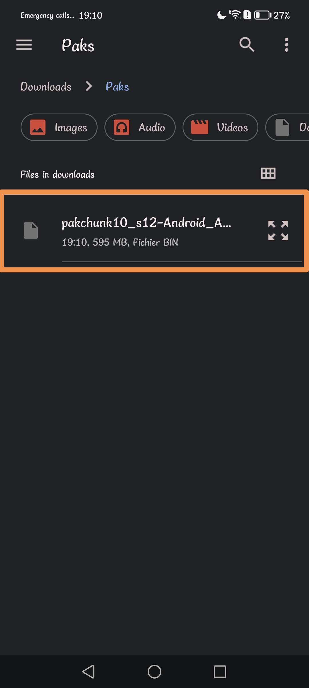
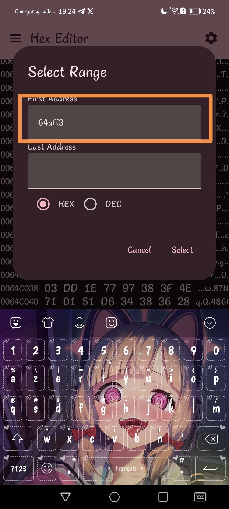
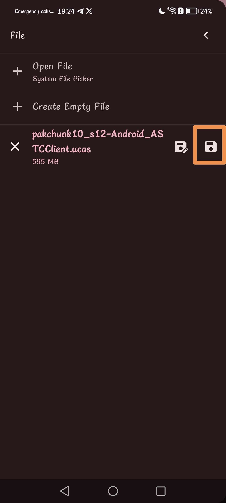

# !!!!! Read the steps carefully and do not necessarily trust everything that is on the image, whether the name of the pak or the offsets. !!!!
## Step 1)
Download [Files](https://play.google.com/store/apps/details?id=com.marc.files) 
- follow this [video](https://youtu.be/8N6MFhZ8XlY?si=ULY7uNq79dFiOSix)
- path pak : Android > data > com.epicgames.fortnite > files > InstalledBundles > GFP_BlitzRoot > Content > Paks > pakchunk35-Android_ASTCClient_s2.ucas

## Step 2)
Download [Hex Editor](https://play.google.com/store/apps/details?id=tk.yunus.hexeditor)
- go 'Open or Create File' > 'Open File' and select ```pakchunk35-Android_ASTCClient_s2.ucas```




## Step 3)
- go 'Select Range' > First Address: ```4DA3960``` > Last Address: ```4DA3FD0``` and Select


## Step 4)
- copy code hex: 

```
8C 06 00 06 6A 88 06 68 00 00 00 00 38 0D 00 00 50 14 60 04 44 82 82 5A 28 00 00 00 22 00 80 61 0F 00 00 A0 0C 00 00 A0 0C C8 10 0D 20 0D 34 34 10 10 29 00 A4 0A 64 C1 00 00 00 00 30 14 4A EA 88 59 6C 1E 49 09 63 15 20 35 E0 09 2D A0 1F 76 01 AB C3 79 B9 31 7D F4 9D C6 69 B5 53 F2 D4 7A D0 32 1D BA EE 4B 70 F0 85 52 33 3E 45 23 A0 7B C4 5B 3E A1 B0 E5 63 3B 03 45 12 AD B0 68 C1 E5 7B 0B 62 98 67 C7 CB 73 78 2B B9 2C 23 00 C8 84 55 03 B0 3A 83 6C 9B 9C D3 AC 8F 09 E1 55 C2 03 DD 1E 77 97 38 3F 4E 71 01 51 D6 34 38 36 28 AB 36 8F E8 94 7E 64 CD 44 DB B0 82 9C F5 0B 58 AF 30 FE F7 9A 5D 05 79 4F 32 C6 04 7A 8F D2 E2 2C 47 96 64 46 BB A7 87 8D F3 2B 3B D9 86 48 CF F8 C0 7E A2 47 CD F9 91 AC F4 14 14 FF A5 EF FF B4 9D C3 62 3E C1 62 D4 5D B4 64 A1 3A 0D 7F FD E4 FF 4D D0 B6 D2 50 1E 4C 49 3C 86 2E 8F 4F 45 0F C8 40 A6 4C 87 54 4E DD 1B 08 A7 82 8D 3B 5D EC 88 E3 79 80 89 94 8D 17 E5 08 1C 0D 9E F0 D2 87 A5 9A CE C2 08 1F 44 A3 25 7D 41 AC 55 5C F8 3F 93 13 1C EF C1 B9 48 21 AD 6A 2E AC 60 80 63 80 97 E8 38 79 B1 64 34 92 08 48 A6 FE E9 4A F7 EE 74 BB 45 3C 1B 61 B7 2F F7 EF 80 BA 43 2E C7 07 76 17 07 8C D1 54 98 99 92 A8 CE 74 F8 B4 73 7E 03 12 1B E1 00 55 00 2F 00 32 00 50 00 4F 00 3E 00 35 00 2C 00 3E 00 4A 00 41 00 67 00 72 00 52 00 4C 00 59 00 5C 00 4E 00 52 00 52 00 47 00 57 00 52 00 50 00 48 00 3D 00 26 00 21 00 34 00 30 00 14 00 36 00 28 00 26 00 36 00 3C 00 6A 00 44 00 06 00 20 00 7B 06 ED D1 7B 98 29 4A E2 71 0D ED D9 85 24 6B 22 58 22 09 7C DC D3 CE AC 51 E3 22 58 A5 6D 55 F8 70 6A 8A 1E 92 E4 EA E2 71 CC 02 27 00 FF FF FF FF FF FF FF FF E9 B3 38 68 E9 10 B7 B9 0B 01 00 03 FB 26 1E 03 1A 01 1B 05 18 02 00 09 1F 06 1C 07 17 13 09 08 16 0A 14 0B 12 0C 13 0D 0D 0E 0E 0F 11 10 15 11 10 12 0F 04 08 14 0C 15 21 16 07 17 1D 18 22 19 04 1A 0B 1B 00 1C 01 1D 20 1E 02 1F 05 20 06 21 25 26 24 22 19 23 23 24 03 25 00 00 00 00 03 0A 00 00 00 00 00 00 00 A3 99 D8 93 43 CA 4B 5B A9 76 EE 44 9D 2C 8D AF D2 32 12 43 6E E1 E3 C0 27 0D 44 B5 01 EF 04 A0 00 92 00 71 AA AD 62 D9 26 EB 40 33 A0 40 82 69 8E 2B E1 39 A7 BA 1C F2 D6 54 B1 E2 FA EA 22 AC 96 91 C6 56 FD CD AC D0 E4 CC A0 55 0D 82 9A 62 6F 60 BD 99 A7 CC CF 25 DE 50 6C F1 8E B8 BE 4A 4F FC B2 EC 71 FE 54 0C BA D5 C4 9B 3C B3 64 32 D0 A0 4E 6D BE C2 0A 42 41 11 36 FB F8 71 B9 61 58 42 F7 5E B6 6C 65 D6 10 BF D9 FC F7 4B 9B CA DE BD 57 59 32 99 C8 58 7A 9C AA CD DC 18 65 56 1D 67 B4 0C 49 37 E2 5B 0E 40 4A 0D 32 1D A9 FE 77 31 5A 2D 02 D8 CC 0F 84 3B 8D 3B FD FC 22 0E B1 AF 62 34 75 F7 16 68 A7 D9 92 27 17 62 50 D4 BF 86 54 24 FA 8E 02 E9 68 63 FB 97 43 A2 81 CA AF AF FE 9A 5C 07 24 45 81 FD 72 55 70 79 62 91 D8 CC 73 BB 99 0B 45 23 1E 1C CA 9D E3 78 67 30 C5 33 89 81 69 E9 B2 0C 24 ED EC E7 49 89 1A 04 EF 68 91 43 40 DD EB 48 EA 09 4F 84 E6 65 E4 68 1C 26 6D 1F A3 3F 71 28 9B 33 1D 04 4F 4E AA 89 22 1F 09 0F 70 B9 EF ED 42 10 FE 9E 7A F4 FC 80 D5 3E A6 17 9A 50 23 57 1B C7 32 37 FB AC E9 DE 67 C7 8F 48 60 95 60 28 86 3C E4 C9 67 58 E5 2E 59 4F 8D E3 F4 79 6A 57 6C 92 2A 94 42 AE 6C 96 88 5E B6 EB C2 AE A0 50 77 B3 B0 AA A8 64 FD 13 50 E5 94 92 27 C3 FA 73 22 DF 06 50 E3 83 DB F5 5E E4 3D 1E A3 CB 72 7A F5 5E A4 F1 38 82 2E 6A 95 5C 51 DD 68 A2 21 40 EA BD 7B B4 C5 15 4F CE D1 F1 64 91 43 41 CC F3 5D 6A 54 61 F1 B3 BC 12 4D 27 36 11 75 8A 41 7C DF A0 83 9E A2 3B 4E 9A F9 CF 82 8E 1E BD 1C 97 1C F7 C9 04 80 80 04 81 92 71 00 BE 38 80 5F 20 04 80 00 E7 93 AA 36 89 14 AD 2A FF DE 7B 78 9A 5C FE 7D CD 8E EE A9 99 E3 66 1B 63 E6 DB 37 EF EB 5A 40 00 6D F1 31 12 C8 27 58 1E 94 51 28 81 6B 0A 00 3E 00 69 9A A6 7E 63 0F 52 84 CC BA 9F 20 5B EB BB 7D 76 B4 D1 89 49 9C 79 BC 44 BD 76 73 2F FA 7F 91 61 A8 E2 34 B5 AE CA 63 FC 3A EF 9B BF ED 41 97 B6 F5 B7 DF E0 3D 08 82 20 08 82 20 08 82 D7 49 BA EB 82 FA 49 31 D8 FA D9 12 57 AC C4 8A 56 CA 26 D7 52 DE 2F 85 DA FC 3A B5 AE 93 CC AB 8C 8D 9C E4 C9 65 E1 B8 FB B5 76 F6 7A 98 4E 37 F5 67 AD 20 41 10 04 41 10 04 41 10 82 08 20 82 08 20 82 08 04 6F B6 5A C7 9B 2F 2A E7 2D 50 FA 2E B1 0F 39 48 A3 E7 90 D4 6C 2C 49 DE CB D3 96 35 48 3E B1 BC FD E6 96 8D 8F C4 AD 2B F5 6B A1 F2 E9 5D DE 8B 26 92 49 80 80 9E 17 16 10 0C 15 16 0C 16 0E 1B 12 29 0E 1A 25 18 18 0D 17 16 0B 29 11 0E 18 1D 11 28 19 10 1A 32 0D 18 33 16 1C 12 1D 1B 10 20 0F 1F 11 1F 0A 1C 08 15 0F 1B 19 0C 1A 2B 22 0B 10 1C 12 1C 2E 29 24 2A 0D 1A 34 31 23 0B 0D 1B 29 22 0C 19 08 12 10 1B 39 10 39 39 0C 1B 39 0C 0E 1B 32 37 0E 39 2E 0E 2E 19 2A 3D 13 12 31 17 16 10 30 1B 0A 35 14 1C 27 15 0E 13 14 10 1D 32 2C 2E 12 0B 40 40 31 3D 1C 33 12 1E 19 0B 37 13 3E 2A 3A 15 1F 0F 2A 1C 20 44 08 16 1A 0C 1B 20 19 1E 0F 0D 00 00 46 0B FF 09 13 06 1B 10 1B 03 0A 02 03 01 08 0B 10 0C 1C 05 06 0A 01 04 11 09 06 09 12 04 03 06 06 10 21 0B 0F 05 18 01 03 02 02 01 12 09 0A 0C 01 07 03 04 04 04 07 0B 0B 0A 00 06 09 0F 18 19 03 04 06 0F 25 05 06 7E FA DB 88 A6 AE 0C E3 BA 80 96 97 A3 C0 C1 0F AD B3 A5 0E BF C5 04 12 AD EC BF 26 70 C0 61 10 00 11 14 55 76 29 9F A6 47 55 EC 45 9A 4B FA 06 9D 38 1F D5 BD 35 83 93 96 45 D8 C3 3B 40 BE 82 48
```


## Step 5)
- go 'Edit' > 'Overwrite' > paste code hex and Apply


## Step 6)
- go 'Select Range' > First Address: ```4DA41E4``` > Last Address: ```4DA4313``` and Select





## Step 7)
- go 'Edit' > 'Fill Overwrite' > Don't change anything and Apply


## Step 8)
- go to the top left and press the last save icon


