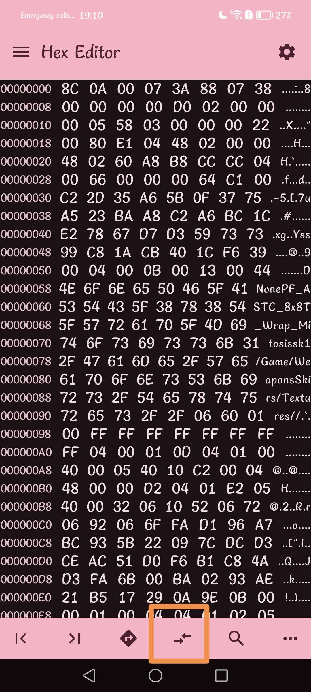

# !!!!! Read the steps carefully and do not necessarily trust everything that is on the image, whether the name of the pak or the offsets. !!!!
## Step 1)
Download [Files](https://play.google.com/store/apps/details?id=com.marc.files) 
- follow this [video](https://youtu.be/8N6MFhZ8XlY?si=ULY7uNq79dFiOSix)
- path pak : Android > data > com.epicgames.fortnite > files > InstalledBundles > FortniteBR > Content > Paks > pakchunk40-Android_ASTCClient.ucas

## Step 2)
Download [Hex Editor](https://play.google.com/store/apps/details?id=tk.yunus.hexeditor&pcampaignid=web_share)
- go 'Open or Create File' > 'Open File' and select ```pakchunk40-Android_ASTCClient.ucas```


## Step 3)
- go 'Select Range' > First Address: ```5CA0``` > Last Address: ```622D``` and Select




## Step 4)
- copy code hex: 

```
8C 06 00 05 87 88 05 85 00 00 00 00 30 07 00 00 50 11 80 04 14 82 83 13 3C 00 00 00 22 00 80 18 09 00 00 98 06 00 00 98 06 C0 08 07 18 07 2C 2C 08 08 3D 00 D8 03 64 C1 00 00 00 00 B1 C0 11 36 A6 D4 FC BB E1 7B D9 EC 48 A8 AF 27 3E 7E 84 1B 28 BD 78 D6 A2 A3 19 4A 11 14 07 C0 EC F6 7A C0 F9 CF 31 15 02 8F DA DD 17 CC 96 B9 FB 53 63 2C 1C 52 FD 51 DF A9 A5 52 8F 37 DB 79 39 19 81 79 D6 09 2C 12 29 7D B9 9C 1C 6D A3 31 99 94 AF AA A5 0E A8 DB A6 ED 7A 2F 3B 00 F6 FB 70 43 03 26 3D CF 98 2E 08 4E FB 29 3D 5F 86 34 B1 EC FC 58 DF 5E F3 23 2C 57 C7 CE 06 BA 6A 5F AC 75 37 D0 34 E5 A3 B7 46 A4 F9 BD 93 E1 27 DF AA 65 DB 37 B0 08 F8 56 BD 53 BE 8F A6 4C C0 60 8A 1C FE 33 2B 41 58 4A 63 F9 3D 51 6D 0D C3 9E C2 2D 35 A6 5B 0F 37 75 D9 68 5F AD 3E 7F 49 64 5D F4 ED 68 91 15 22 64 D2 60 DF 82 AC 9D D3 64 C3 B9 8F 16 66 3B DC 4A 22 B8 F3 20 2E B8 42 27 6B E2 D9 86 3F D2 DA 11 64 BA B9 0C 8D 17 39 0B 02 EC DC D2 66 AD E4 5C 44 3C A5 C8 75 4F A5 5A 1D 50 44 04 ED EA 6D 3F 2A 77 65 23 8B ED 0A 74 62 CA 24 C7 6B 8A D4 37 65 87 E3 27 4D E5 E5 B0 62 15 F0 F7 D1 49 E1 B2 BA 2D 66 36 93 EC AD 24 2C EC 81 DA CD 9F 06 BC 79 32 FE 16 3E C9 5F 86 51 7F 63 39 E7 30 FD 1D C6 5F F9 5A AF C9 8C F5 94 4D 12 20 03 DB 8A CA 93 B6 BA B3 6A CF 34 D4 C3 8B A9 51 09 D0 DD 38 F5 7E C8 84 62 9C 81 A9 44 FA 2F 86 28 BC 00 78 70 35 37 B5 FD 84 69 D2 27 2A 6B BE B6 07 29 76 A9 DF 43 2B D9 D0 C0 CE 60 57 6D 01 20 BF 96 AB 0C 42 04 E1 E4 E4 29 35 94 6B 7B A6 73 48 6F 2B B5 80 74 AB 3E D9 B6 50 9B 85 76 7B 91 82 6D 1B 37 36 50 F4 D2 55 31 13 BB 06 8A 2C 22 2F 3D 86 62 6A EA 50 12 CB 59 E5 0A BD 19 C8 FC 6B 22 64 33 71 6B CC 13 FB D6 B8 2C 9E 2D FF 79 C2 31 55 00 0E 00 1A 00 0D 00 0E 00 0E 00 11 00 0C 00 0C 00 0F 00 0C 00 0F 00 11 0B 00 0D 00 0B 00 10 00 0D 0B 04 1C 00 0D 00 0A 00 11 00 0A 00 11 10 00 13 00 10 00 10 11 10 00 09 00 0F 00 12 00 12 00 12 00 15 00 18 00 18 00 18 0F 1C 00 3F 02 ED D1 7B 98 29 4A E2 71 0D ED D9 85 24 6B 22 58 22 09 7C DC D3 CE AC 51 E3 22 58 A5 6D 55 F8 70 CD 2F 28 C0 01 B9 E6 53 D4 12 3B 00 FF FF FF FF FF FF FF FF EB FE 6C 2A 15 14 30 2F 0B 01 00 03 FB 2F 1C 80 15 38 00 00 05 00 03 06 1D 01 16 16 16 1A 1B 21 21 22 22 23 23 24 24 12 28 36 00 11 37 34 34 35 35 30 30 31 31 0E 0E 14 14 15 15 00 00 0C 0C 17 17 0D 0D 10 10 0A 0A 0B 0B 08 08 07 07 09 09 3A 3A 1F 1F 1E 1E 20 20 0F 0F 19 19 04 04 03 03 39 39 26 26 25 25 38 38 02 02 05 05 13 13 01 01 2D 28 2D 00 2A 27 2B 28 2C 29 33 32 2F 2E 00 00 00 00 00 00 00 00 A1 74 F0 83 05 45 B3 E6 25 2F 69 C4 12 C4 0C 8C 4D 2D 24 21 09 64 66 77 19 9C 11 15 18 A3 48 00 FB 17 0D 0F E3 E3 CC EB 99 B7 14 2C 94 A8 32 94 2C CF 52 95 01 8F 88 1F 5E 8E 3D 66 12 9C D3 43 AF 0C FC F3 85 D0 F6 6D A0 B7 F4 B8 BF C6 15 34 59 77 88 B7 FC 51 96 3B 1F A4 37 16 49 1D 4E EC A9 22 19 96 EC 59 51 14 71 46 D8 7B 98 9C 43 3F 19 40 5B 19 71 94 13 7D E2 CB EF 3D 7B DD D0 FA 1D 2C DD 46 F6 F7 82 0B E5 36 B2 A7 69 A6 64 B5 65 A6 E7 E1 66 B6 AE 44 4E 1A 90 B6 DB 12 29 A7 DD 0C C5 49 E8 8F B5 98 DA B7 F6 F5 D4 7A AE 01 17 E4 C2 A0 A9 60 28 CE 25 38 35 1E F1 A9 46 B9 4E DD 9B A4 8C 97 8C DD 2C 2C 4A CD F9 D0 AD 7A 11 C8 A0 55 90 93 7A 9B 33 D1 60 9E 94 8D 0D 4A B8 C1 23 D9 EB 72 51 0E 6C 33 53 EC B4 4E 4A 8C 4D A2 C6 03 80 80 04 91 82 71 00 2C BA 4E 30 03 70 00 9F 00 3D 05 02 03 05 02 02 05 05 05 05 02 CA CF 07 05 05 D3 CC 47 05 C8 CF C5 40 D3 D4 2F D7 01 C9 D3 D0 DC D3 C7 7C D2 DB D0 5C D3 D3 C8 DB D7 C7 E6 C4 D3 C5 C5 D7 E3 D4 C8 A3 D4 C5 13 C8 19 D7 C7 DC CC E4 C4 FA C4 DB 9B D4 FA 39 19 94 35 35 05 C8 C8 CC D8 F4 C8 F8 3D 1D FF E4 F8 3D 15 C8 E4 C8 D7 D7 E4 C8 D3 C8 FF D9 DC DB 52 12 DB D8 D8 F7 48 B5 29 C6 48 05 D5 57 D9 16 39 E4 3D FD 1D 2D 1D FD FD 3D BD 1D 2D 1D BD 3D 3D 3D 3D 3D 3D 3D 3D 3D 3D 0E 10 C3 1D AB 7E 12 00 02 01 80 80 52 17 0D 10 10 09 14 17 10 0B 15 1A 15 0A 18 0B 19 0C 0B 15 10 09 0E 0C 24 18 09 23 20 27 1C 29 09 1E 0C 10 19 0A 10 22 09 23 0B 27 0C 12 2F 22 0C 2C 14 08 2E 0B 12 0D 0E 1B 10 31 09 16 2A 2D 0A 15 1B 2C 18 3D 08 16 1A 0C 1B 20 19 0E 1A 0E 1D 1D 33 20 02 0C 00 4A 91 6A 1A C2 54 CA BE 82 9C 6E CF 6F 50 3E 84 05 88 7B 8D 08 11 00 D7 E3 E7 BE 6F EB BE DF D7 BE 48 63 24 49 92 A4 31 3E 1F CB DB D7 71 3E F7 EF F9 21 C6 48 92 24 89 F1 07 00 65 E9 24 92 49 19 7A 5B E3 87 DA D3 E7 5A FB FF 44 4D 94 72 E7 B6 FC 61 88 6D 02 06 05 72 88 00 B3 0C 78 BA 8C 76 D3 B5 6E 31 90 4A
```


## Step 5)
- go 'Edit' > 'Overwrite' > paste code hex and Apply


## Step 6)
- go to the top left and press the last save icon


