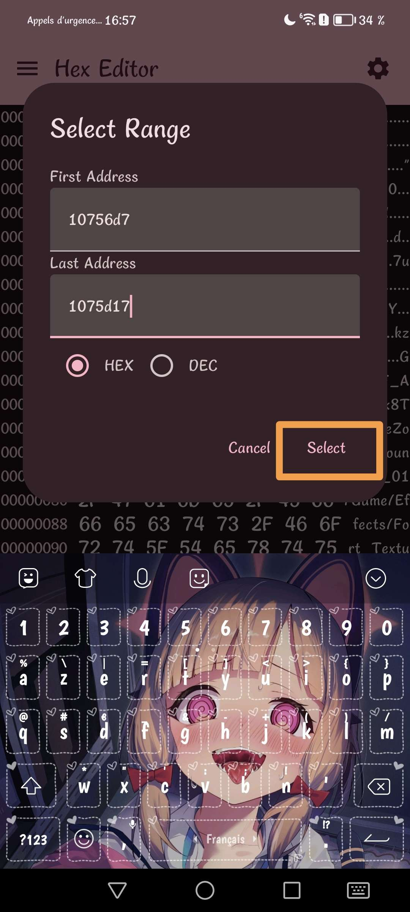
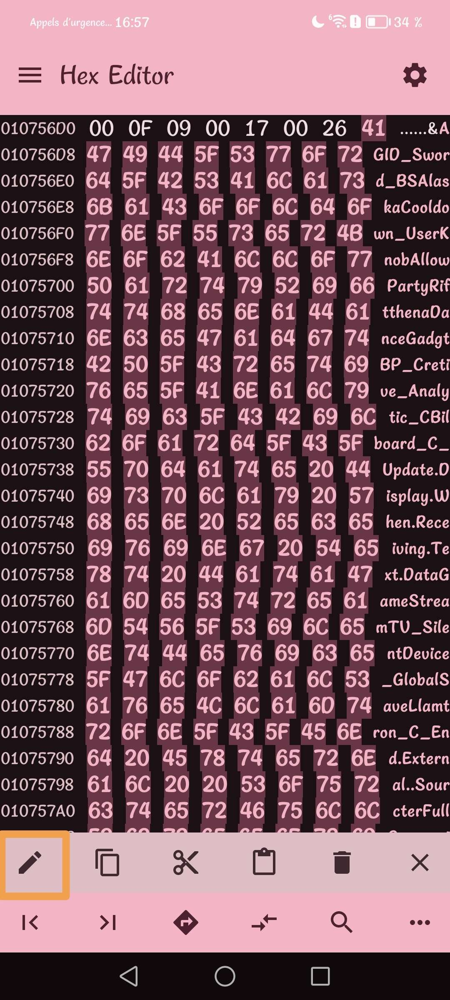
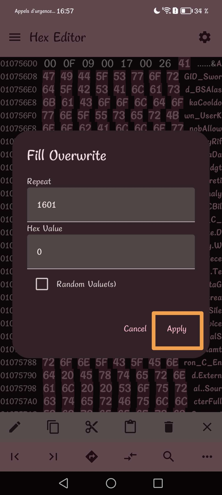
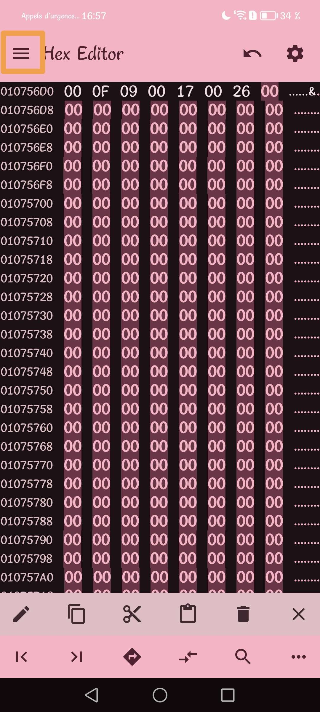

# !!!!! Read the steps carefully and do not necessarily trust everything that is on the image, whether the name of the pak or the offsets. !!!!
## Step 1)
Download [Files](https://play.google.com/store/apps/details?id=com.marc.files) 
- follow this [video](https://youtu.be/8N6MFhZ8XlY?si=ULY7uNq79dFiOSix)
- path pak : Android > data > com.epicgames.fortnite > files > InstalledBundles > Frontend > Content > Paks > pakchunk20-Android_ASTCClient.ucas

## Step 2)
Download [Hex Editor](https://play.google.com/store/apps/details?id=tk.yunus.hexeditor&pcampaignid=web_share)
- go 'Open or Create File' > 'Open File' and select ```pakchunk20-Android_ASTCClient.ucas```


## Step 3)
- go 'Select Range' > First Address: ```AE4E20``` > Last Address: ```AE672B``` and Select




## Step 4)
- go 'Edit' > 'Fill Overwrite' > Don't change anything and Apply





## Step 5)
- go to the top left and press the last save icon


