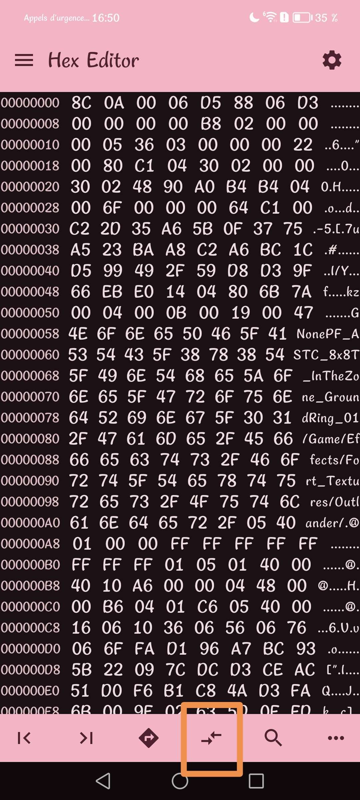
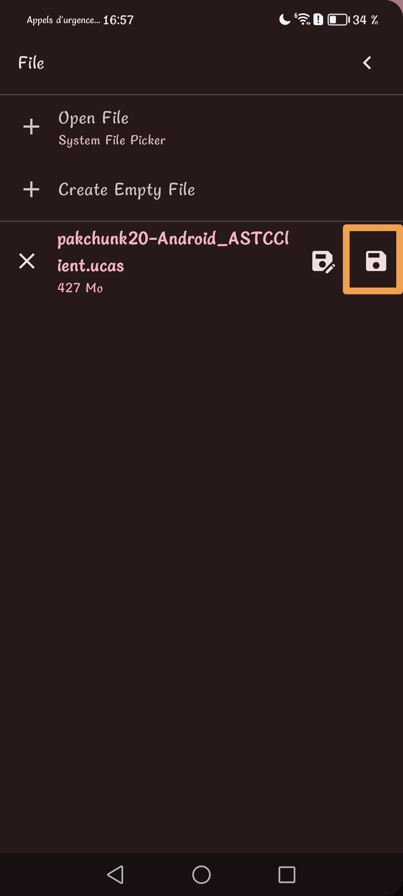

# !!!!! Read the steps carefully and do not necessarily trust everything that is on the image, whether the name of the pak or the offsets. !!!!
## Step 1)
Download [Files](https://play.google.com/store/apps/details?id=com.marc.files) 
- follow this [video](https://youtu.be/8N6MFhZ8XlY?si=ULY7uNq79dFiOSix)
- path pak : Android > data > com.epicgames.fortnite > files > InstalledBundles > Frontend > Content > Paks > pakchunk20-Android_ASTCClient.ucas

## Step 2)
Download [Hex Editor](https://play.google.com/store/apps/details?id=tk.yunus.hexeditor)
- go 'Open or Create File' > 'Open File' and select ```pakchunk20-Android_ASTCClient.ucas```


## Step 3)
- go 'Select Range' > First Address: ```1F47200``` > Last Address: ```1F4823D``` and Select




## Step 4)
- copy code hex: 

```
8C 06 00 10 37 88 10 35 00 00 00 00 80 2B 00 00 00 0B C9 09 01 00 22 00 80 29 2C 00 00 F8 2A 00 00 F8 2A 10 2B 58 2B 68 7C 7C 58 0A 01 36 20 64 C1 C9 0D 23 61 7B CC 2F 83 6D 9F CF E9 23 B5 6D 58 60 D6 43 73 43 D4 C3 E9 62 53 90 1C 10 8D 27 85 BD 79 EB E9 8E E5 2A F6 E8 5D DC 33 6B 51 36 90 5A 88 A8 3E 11 37 A0 18 76 99 43 D2 7A 23 5A 83 54 5A F9 99 D4 F2 67 74 62 A3 8E 03 CD 1D A0 79 03 34 20 5F 98 38 80 F0 21 84 ED FF C7 92 BF F0 A3 BF 2C 6D 80 A9 49 60 41 E6 81 DA 80 B1 61 D5 9B B1 19 62 25 CF 8B 7A A7 69 6D 4D 3C DB 1A B3 B9 F1 41 D6 3D C2 0B 72 5F FF 46 B3 BC E6 CC 72 AC 61 69 E1 4C 3D B3 E8 78 19 F6 7B 3A 5F 21 C4 B4 3A F4 D0 C0 88 72 8A 14 8F B4 C8 9D 42 A5 18 4A 28 9A 95 FC 47 FC E3 89 11 17 B1 F0 EC 61 5E 37 5B 1D 1F AC D0 89 17 7C B0 3A 5B 97 19 A7 01 4E FC 40 9C A7 01 E0 C7 23 38 CA 42 7C DC 4B AD BF DC 55 B7 E7 00 8A 26 62 E9 F3 87 7D EB 67 5D 00 DA D8 15 A1 4D 69 67 53 98 C6 A2 A1 FE A2 95 EF 1D 14 57 74 13 47 DC BE B1 F4 DA 1E 34 1D 1B 27 6F 68 CE 0E E3 45 4A 4E F1 86 86 CA 4B D6 22 C7 05 AB 4B 06 9F CF 22 66 16 68 A2 3C 9E B5 8C BF 1D 8C 92 66 B5 86 82 AD 7A 38 D1 E6 13 13 91 69 49 52 00 C1 14 35 BA ED C7 69 57 E4 1D B6 1E 53 D9 AB A8 C6 60 5F 3B B3 9B 73 EE 0F 0C 11 17 12 FC F3 CF E5 86 BC 06 6C A8 08 8E AF 14 0D A7 4B 9E AB A2 37 4A 52 45 AE 86 07 01 77 B8 EC B9 CE 54 66 61 BC E9 FC D8 C4 9B F0 E5 E4 6C AF 3E 93 27 A9 F8 02 72 22 35 23 50 FB B1 39 EE 7E 58 28 CD 8B 9A C8 F6 F3 89 61 CB 7E 49 A0 86 6C 36 99 C2 06 3F 8A 0A E6 28 83 69 82 7A 70 DE C1 CD 3A 5A B9 B5 B4 8A BD 96 9A 81 AE 79 D9 9E 2A AB 61 A3 11 2C B2 7C 05 FF 4B 90 8E 81 64 E8 6E B5 67 CE 9A A8 85 F4 68 5D 1F 63 3D 3A 8B 89 0F ED 8C 79 A5 37 36 13 33 BC 0C 6F 76 53 22 17 DF D4 0E 83 2F BD CD 6A 62 8B EC 73 E4 71 1F F6 E5 C8 9E 23 A5 8A 21 EE AB EA 57 E2 FD FC 09 FF DF B6 0F 24 2C 5F 9D 89 61 C7 9D 7A C7 0F F7 0F B2 FF 5E 4A 9B E3 DF E4 9B 50 22 C0 5B 56 01 48 9B A6 91 2A 19 65 B1 0E 6A B1 85 A7 3B 3C 3F E1 47 93 F3 49 B1 92 04 92 C9 3D D3 39 EE A6 B5 22 EF 2E 21 5E EF 63 BA 11 DA FE 80 4D 4F F1 27 D3 1C F6 6C 73 A4 06 A7 1C CB D8 E2 0A E6 B7 2D D2 FF EA D7 18 50 96 A8 02 73 1B 93 5A 57 D8 C0 B4 FA 21 39 94 16 31 53 FA A4 78 02 7E 9E B4 BC CD 2E E6 86 54 15 D0 2F F0 06 07 04 74 C4 0A 4A 52 0B F1 91 93 1D 51 32 37 C0 4F 90 9F 52 C1 B2 31 7F F3 1F 40 3B E3 60 6E C4 DE 18 6B 79 F8 B0 8D B5 0A BA 07 63 34 28 CB 59 D2 44 79 CB 63 8D 83 EB 92 64 D4 04 53 75 C6 F5 44 1F 41 AA D9 56 C8 7C 22 2B B2 0D 2B C3 4A C0 DB 1F 9C 0E AD 45 28 A7 6C 7D 67 41 8F 5A 3F C6 4F 9C EA A7 33 99 13 DC 37 8F 58 01 A6 5D A7 FF CC A5 CD F1 6F 98 F7 45 1A 4D BB AA 5A BD 4B 50 F2 46 9E 20 BB DD C1 1C 6E CE C8 56 02 5E 62 A7 4B 5A 0E 1D 03 69 F7 E2 C7 7B 45 DF BE 49 FC 53 DB 5D 85 07 02 7A 46 59 61 B6 CB CF A9 11 ED A6 3B 2B 06 94 C4 0F B1 6B 48 13 09 52 C3 E7 46 07 D9 19 B0 4C 99 99 C8 50 39 F0 2B B0 15 D6 5C D6 97 55 7C AE 12 46 C2 67 30 3A DC 54 34 AB 89 D8 03 40 5F 89 2A 06 B2 DC E0 32 80 EC 56 3E 62 67 77 D1 D0 E0 9A 5D 65 CB 41 A2 14 03 FB 54 D0 18 8C 16 39 61 0E 86 21 79 7E 7D 86 7D D2 2D E9 8B 55 C2 F4 C3 27 BD EC 28 40 73 63 9C 99 D0 78 BF EE 69 A0 09 57 24 96 A1 3F A2 0F 22 C8 EB 89 6B 82 5E 65 F0 34 1F 0B 23 84 17 17 D6 01 34 BC 66 86 1B F5 5D 28 D1 CB E5 6C 6F 76 DE 0A 99 84 CC E5 42 09 31 3A CB 8A 33 FB 5F 42 28 20 DE AF 87 78 53 F8 82 04 16 8E 30 A2 39 6C C2 5E 6B 2B 6F 86 8C B3 AD 23 21 97 52 DA 87 97 69 42 6B E0 D1 1F 9D 67 13 18 41 EC 75 7E FC 4E D1 5E 9A 11 AF F6 61 BD FA F1 31 BA AA 80 B6 40 A4 AE 7D 1D B2 FA E2 5E 3B 70 3F F5 2E A6 97 C6 D0 C8 C2 79 02 4C D2 9F 34 18 D0 D9 93 0F 0E A6 65 67 AF 71 53 AA 90 BF 71 8E 26 90 57 E9 52 62 FF E7 47 4F 12 1D 8E 12 A2 AC 2E 02 7F 49 8E 78 57 B3 3D 8B 71 27 7E D0 F0 5D BD 82 B8 E5 95 64 DF 15 AD 9F 4B 5B FE 4B 7B FB 6E 9A 9C 47 76 B5 E4 00 47 4C 87 F4 58 E5 28 01 23 A7 D5 EC 94 23 DA 3E 73 93 3E 08 38 14 24 87 D5 30 A6 8F 26 15 C7 10 30 42 B0 B3 BF 1B 24 04 D2 75 C5 96 87 68 6B 0C 87 51 34 9F B0 6A 37 0A 31 03 58 A1 45 DE A5 B0 48 2C 3C 83 E5 6C 65 66 7C 71 22 3E F7 13 C2 F5 40 93 1F 93 D0 C6 D9 69 05 7F 31 6E FE 77 B5 AC F2 E5 68 D4 74 41 2F 9D B4 FA 25 35 F8 9A 17 2F 0A 75 61 24 B6 09 6E 11 CF 06 EE 20 87 DA E4 1F 3A 8F 1B A8 48 89 A0 B8 01 76 A4 B2 1B 29 CC 73 4B 29 08 F0 28 3A 28 C6 A4 AC B8 36 0E BA 8A CF BE 9F 69 65 F9 1B 5F 90 59 CF CD 9C 68 17 7E 76 72 A7 DB E1 6E FF AC 99 48 E8 CE D5 F1 8D 58 3B 5F 1C 19 3C 9E B7 46 3E D3 E9 39 B9 22 4D 69 F0 26 E7 34 B5 D8 42 1E 50 5E 48 A0 A9 E3 43 BB 71 DE CB 97 E5 61 2C 68 74 5A 57 83 ED 79 3A 8C 4C 05 FF 16 72 8F C2 EE 2B 07 25 0E CB E6 0E 72 37 1C 73 72 92 C9 1D F5 2B 2E 84 33 0B 52 3B 74 1E 01 24 18 D0 CA C2 4B 58 4F 40 7C 2B 67 27 3A 55 FE CC 9B B9 49 71 79 EC 11 2C 7C 3A 0D AB 54 96 D4 B5 17 0D 86 7A 44 87 95 16 11 5B A1 90 41 F6 0E 5A E5 95 56 C5 99 3E 83 0F A9 3B 17 3D 54 D4 39 EA C9 BF 24 26 BE 37 8D 19 9D 90 2B C1 6F EE 5B EC 62 6F 57 02 0A A0 EF 6D C5 EF 48 22 62 99 72 07 16 84 EA 68 36 E3 19 FB 99 0A 48 C2 65 EB E7 7F F3 88 4F 95 F6 EA E4 03 2B E2 BB 4B 27 E1 74 D0 A0 3F 2D FC E2 30 79 65 1C DC A5 32 32 73 8C CE F6 6E 70 63 48 B0 D1 ED 7C B2 B0 14 4D 86 FD EE 73 72 DC 40 18 CD 83 22 CF 58 9F FE 96 30 E5 A0 3A 6B 34 C1 D1 97 3B 7B BC 98 1E F1 19 5B B1 47 A5 9B F9 D1 E6 01 27 B5 93 77 DD 35 EF B1 F8 B6 0A 2D 69 BE 71 36 A4 97 14 9A BC 55 45 1F 9E C5 6D B1 D3 A4 D8 F1 B8 AE 8B 3F 71 7A 75 92 03 AE AA 22 3E 51 98 F0 EF 3D 1F 20 44 3D C9 49 3B 6D 76 EA 28 37 6E 45 D1 03 8F BE AD 57 81 45 08 0D 0F D4 91 DC 39 E5 0A 5D C1 A1 65 3F 42 06 01 27 D3 BD A8 53 CD 2C 45 DF 22 FA 1B 0B 1A CE 25 2F DC 14 E2 93 2D 09 AF 09 86 9D E9 87 D4 C9 1E 92 1E 57 B3 AA 2B B8 50 0C E5 CA 84 5C F5 09 19 F8 95 A7 A6 58 DF 3C C7 E8 38 7B 87 4C 2E AD 1B B6 D5 93 98 ED 6D 01 F7 B2 B7 34 45 99 2D B8 9A A2 D8 4A 54 FA C6 70 03 BC 36 AB 8E 6C 94 46 17 C7 81 F0 B9 2D 7C CD 0E E8 1B 01 2C 81 69 36 E9 4E 64 E5 01 DA 33 04 86 0B 60 84 C4 9D 8E 9D D1 9C EC 0D 1D 01 E1 FB 28 33 22 22 51 B3 A7 60 A6 91 D7 A1 EE 9D 37 1F 67 B5 6F B3 B5 81 DB DA 35 6E 98 80 D0 CD 65 73 57 05 88 8C B6 4D 34 7F D0 A3 E8 8C 20 9C 14 9F 63 57 4B BF 09 5D 08 B7 46 A0 8B 59 49 51 24 10 E3 3A E3 31 A6 12 B1 3F 8B 0C 6B 44 8F A2 7A 02 07 E1 F3 AB 3F B2 93 CA F6 18 F8 0C 55 E0 73 E5 58 31 DA 0C AB 7A 81 FE 5E 7E 05 36 EC EE 21 3B C0 1B DE F1 FB 00 41 47 7A 39 ED AF 8C 6A 92 E6 18 2F C4 31 B3 F2 F1 48 5D A0 E8 6E 07 3C 2D E3 B7 D8 E4 1A 07 0D 64 95 7B 94 F8 73 55 D9 73 5A 74 62 60 41 DE 52 94 E6 03 DE BA 9C 3F 8B 29 B4 CE A7 C6 AA E7 45 63 BA D2 18 12 68 98 DD C3 FB B2 49 B4 96 4C 9F DF 5D 30 5D 0C C7 8D A7 D9 FF 50 17 C6 BC C4 2B F9 E7 BA 9B 3D 0B A6 1D 0F 93 95 2B 5D C8 6A CD 42 01 CF 0A C4 A7 9E B2 02 4D 61 95 0C 12 00 0D 00 17 00 17 00 0B 00 0C 00 16 00 3F 00 18 00 17 00 17 00 1A 00 30 00 25 00 24 00 1E 00 2B 00 2A 00 36 00 2C 00 2C 00 1D 00 1B 00 0A 00 1A 00 20 00 19 00 21 00 24 00 21 00 1D 00 12 00 10 00 27 00 1D 00 2E 00 27 00 23 00 23 00 2C 00 24 00 0A 00 04 00 09 14 20 34 2B 00 1B 00 2D 00 29 00 40 00 41 00 36 00 39 00 33 00 2E 00 3B 00 30 32 27 35 38 37 00 2C 30 21 1B 2B 00 28 00 1F 00 24 00 22 00 23 22 26 25 27 28 22 27 00 15 00 2F 41 23 0E 26 22 1B 27 00 2B 00 17 00 27 00 2A 00 2D 26 2F 15 20 00 1C 24 35 21 07 00 24 1C 20 00 17 00 18 00 19 00 1B 00 22 00 1C 22 1E 1E 00 1D 00 19 00 1C 1F 14 1C 1B 00 1B 00 1B 00 16 13 18 15 16 17 00 19 19 15 1A 18 1C 19 12 12 00 12 18 07 10 1B 1B 15 04 1B 06 00 0F 00 21 11 16 25 09 26 00 57 6F 72 6C 64 49 74 65 6D 43 72 65 61 74 69 76 65 42 65 74 61 50 65 72 6D 69 73 73 69 6F 6E 73 2F 47 61 6D 65 2F 2F 02 AF 96 4F D2 93 83 01 52 F8 06 22 11 9B 30 25 50 E3 22 58 A5 6D 55 F8 70 77 52 08 01 FF FF FF FF FF FF FF FF 55 56 30 15 01 50 6D 22 0B 01 00 05 DD 80 11 61 00 05 00 03 E0 B9 02 08 50 61 72 74 6E 65 72 00 0A 44 65 76 65 6C 6F 70 13 56 4B 65 55 47 43 80 05 03 01 E1 E2 DC E3 C0 DB E1 C1 9B 9C B0 DA C2 00 05 94 2A A1 09 41 6E 61 6C 79 74 69 63 19 45 70 69 63 F9 03 01 10 69 63 65 4C 6C 61 6D 72 6F 6E C9 03 86 0D 79 53 63 61 6E B4 B5 B6 B7 60 01 80 05 02 80 02 DF 58 57 56 53 2B 03 10 53 75 6E 62 75 72 73 74 8E 54 75 76 77 62 5C 55 4F 5B 5A 50 51 52 9D 01 06 46 6F 63 75 73 8C F9 FB BE BF D2 06 4D 65 65 BB A3 01 CD 9F 43 68 6C 73 C3 AA CA AB AC F9 04 01 A9 DE B8 C4 0F 74 61 6D 69 6E 61 A6 03 12 53 74 6D 8B 01 8A 06 16 05 E0 DD 00 0C 43 6F 6D 70 65 74 69 92 00 C5 C6 C7 BC BD C8 BA 01 33 FC 01 0D 45 6D 65 72 61 6C 64 47 6C 61 73 73 00 A4 0E 50 72 6F 78 69 6D 69 74 79 74 F8 D3 CE 04 00 29 28 06 12 13 9E CF A0 D6 B1 04 0C 45 61 72 6C 79 41 63 63 65 73 73 17 B2 59 10 0F 0E 11 0B 0C 0D F5 7A 3F 40 3D 3C 47 48 A5 03 16 45 6D 6F 74 65 43 6F 6E 74 72 6F 6C 6C D0 89 91 D9 57 65 62 6C 69 6E 6B 4A CC 01 85 AE D4 A2 43 70 62 6F 61 72 64 A8 15 4D 71 75 69 6E 53 74 6F 72 65 8D 07 48 69 64 64 65 6E 5D 5E 5F D1 8F 65 64 F7 F6 79 78 F4 F3 01 0B 70 72 65 63 64 EC F2 EA ED EB E9 EE EF F0 F1 E0 CB 27 20 99 97 95 96 9A 98 21 22 23 24 25 26 02 63 6D 00 6B 6C 69 6A 01 4D D7 02 02 B3 93 41 AF 07 01 17 18 19 D8 12 6F 72 73 44 65 62 75 67 42 6F 74 41 3E 1D 7B DF 7D 7F 7E 82 83 81 80 66 2E 21 A7 74 37 3B 3A 39 46 45 43 38 44 60 FE FF 87 61 73 E0 D5 E0 AD 4B 68 31 F9 88 42 49 36 35 4E 2D FD 02 01 FA 01 1E 1F E7 E6 E4 E5 1E E8 0A 05 1E 2C 14 1E 07 32 67 2F 30 71 72 09 08 15 34 70 6E 1C 1E 1A 1B 7C 1E 4C 84 21 90 6F 80 05 03 01 00 00 00 00 20 08 E8 01 78 94 6A AD 16 D6 2C DC 12 AA D7 6E AB 95 A6 4A B6 BB A9 24 76 EF B9 B6 D5 96 FE CF 19 BD D6 C3 DA C7 9D 97 2E A8 0A 88 00 A0 78 60 2C DC 50 20 0C 00 27 18 D3 81 70 D1 08 40 67 00 B7 13 9B 4C CE 6B 29 D5 CA 69 B9 B4 52 4B D7 DA 55 B3 52 16 CB D2 6E AE CB EF FE FB AE D5 5F 0E 03 84 AD FF BE C1 7B CE 1C D6 02 3C ED 28 30 F2 36 13 18 AD 65 86 1F FF 64 2A F5 98 84 CB 85 8D 99 92 7C 26 B7 CC A9 1C 6D 7C E9 E3 35 E0 7B 01 08 01 32 E1 39 ED 93 61 94 C3 34 81 40 D0 03 FA B3 05 B9 90 E4 F8 5C 2F CD 2E 6A 57 6A 2B E7 65 AF 2D 5E B7 AF 1F 56 D6 BA D2 CA 62 55 6A 77 AF 4F EB 71 C7 77 ED A1 9F F3 99 6F C3 A1 6F C7 B7 19 64 62 02 70 DB 32 F0 6C 42 1C F3 8A 9D 70 4F 37 32 45 5A D6 C0 03 B9 FD 0F 29 25 A5 D7 D8 28 1D C6 83 B4 8C D4 93 FD 03 1C 80 04 A4 94 98 AF 52 20 09 3C E4 72 E6 3A EE 04 AE 00 50 F4 BD 00 08 F1 08 44 48 7E B8 E0 43 97 23 9B E6 81 47 A0 EE 61 1F B6 68 94 6D 08 04 80 57 84 77 07 1C 8B D4 8C 73 28 1C 49 95 4C 92 1E 42 64 B7 CD 2F C6 B9 6C 39 95 C0 C9 BF 11 FE 27 3D 75 38 67 46 5F 10 09 0E 41 1F 33 8D B7 7A 61 E0 CC 35 9B FB D5 D9 FB F6 EF D6 56 B5 5C B6 D4 A2 F5 2D 65 95 A5 76 59 45 BB 94 AE 95 D7 49 C9 FB 93 27 80 81 14 09 0C 0A 18 0D 10 16 14 17 0B 19 0D 10 08 0A 23 1A 25 17 21 18 20 28 12 0D 0A 14 11 13 0D 1A 2A 2A 16 14 13 0F 0C 17 08 0F 09 0E 17 08 2E 21 20 17 21 1A 25 28 1A 24 13 0E 20 1A 08 18 42 11 13 1C 08 18 0C 19 24 0B 1B 27 14 1B 23 22 19 1D 1B 1D 15 24 08 1C 25 33 1C 29 23 1B 31 34 1B 19 1E 24 1B 3D 1D 40 22 41 1B 2D 41 42 1A 44 43 1C 40 2A 1C 24 1C 4A 19 25 40 24 40 1C 35 2F 1C 2B 4B 2B 1D 41 34 41 1C 42 23 34 44 40 45 43 2A 23 1B 2D 44 2D 1C 31 1B 4D 20 18 20 35 43 32 49 1B 38 1C 30 1D 2F 1B 40 23 42 1B 2A 1C 3C 1A 3E 1E 3C 3D 3D 2A 1C 2D 40 4B 33 23 22 41 1B 41 1C 51 3F 1E 2E 1B 1A 22 2D 3F 40 1B 32 19 49 16 40 52 1B 54 40 41 1B 16 4A 1C 31 44 23 46 1F 49 40 29 1A 27 1A 2F 33 13 35 1C 3C 1B 3F 1B 38 3A 22 40 16 33 52 1A 3F 4C 2C 2A 1B 2A 30 1A 22 1B 56 1B 58 50 56 55 1F 29 1B 53 20 52 1E 30 1B 51 1E 4C 4C 1A 1A 21 1A 30 05 14 01 24 00 44 0B FF 14 00 08 02 08 00 00 0A 04 04 00 00 02 FF 23 06 15 05 06 02 05 06 04 01 01 3A 42 42 42 35 32 35 42 42 42 2F 00 05 01 04 00 1E 39 02 00 1C 32 42 42 35 03 0A 0E 3D 44 44 44 01 00 05 20 26 02 0E 32 32 32 08 24 42 31 3C 0C 24 00 08 20 44 51 4A 4A 42 49 42 4A 4A 08 03 25 00 24 24 44 4B 3A 41 3B 09 04 15 06 08 1E 32 49 49 41 49 49 3C 00 1A 06 0A 5F 41 06 1B 35 3A 3A 3D 29 44 4B 06 42 42 42 42 03 08 0E 02 57 15 1A 4B 4B 4A 54 44 44 3B 44 32 3E 42 20 19 0A 37 4A 0E 0E 42 06 0C 04 16 35 00 5B 06 42 42 08 03 1E 0D 06 08 3D 03 1B 37 3E 93 05 20 3E 20 01 44 18 27 42 13 1B 3E 3E 13 21 4B 4B 01 00 14 06 0C 0E 1A 50 42 2D 0B 0A 36 26 26 08 1C 3F 3C 3C 21 3E 3E 2F 35 3E 2C 32 74 3E 34 74 3E 3E 74 3E 3E 3E 3E 3E 06 2C 3B 3C 2D 35 42 42 3A 42 42 41 32 41 50 42 42 42 42 42 42 5A 6A 4C 5C 42 42 42 4B 5B 4F 35 29 3D 29 32 10 9B 01 62 00 DC 01 9E 01 2C 11 FD 10 00 7F 13 01 11 00 01 90 10 00 D0 74 22 40 0E 9E E3 34 45 23 71 49 7D D0 4C 44 AF 61 63 58 AC B4 E4 26 28 6F 18 39 06 56 F7 F1 9F 6D 76 21 06 A6 20 5E 4B 22 B9 88 A1 75 ED 3D 22 69 CF 52 18 E2 84 BE 63 0E F1 61 6C B9 0D 94 37 24 B4 B6 A1 0E 10 EA 73 F8 7E 40 00 8C 0F 1C 40 4A 13 E5 23 6B 0F 21 1B D2 5D EE 07 7D 9A AE 1F 9F CD CE A1 90 EE 13 DE 75 A4 6C CA 92 A6 03 FA 88 17 60 E4 60 29 51 2B EC E7 09 58 71 82 EC 54 1B FC F2 E3 0E 00 36 6A 60 18 78 38 CB A5 82 F8 41 67 74 85 CA 50 09 10 4D A8 A1 41 60
```


## Step 5)
- go 'Edit' > 'Overwrite' > paste code hex and Apply


## Step 6)
- go to the top left and press the last save icon


