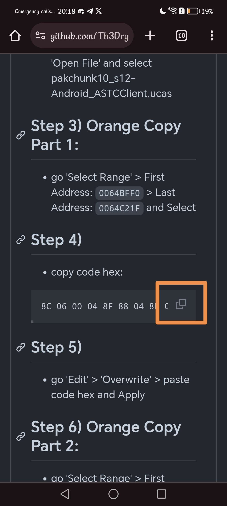
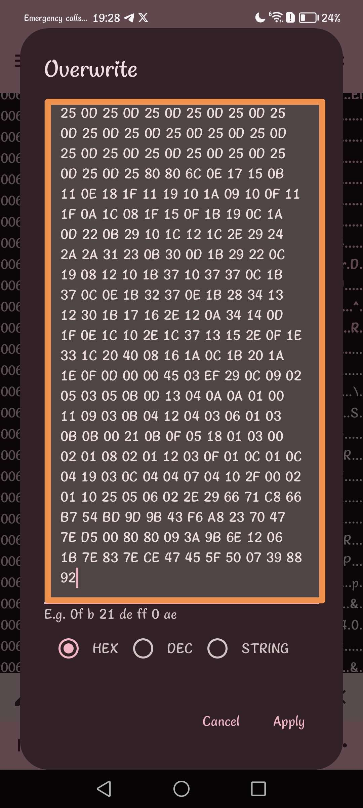

# !!!!! Read the steps carefully and do not necessarily trust everything that is on the image, whether the name of the pak or the offsets. !!!!
## Step 1) 
Download [Files](https://play.google.com/store/apps/details?id=com.marc.files) 
- follow this [video](https://youtu.be/8N6MFhZ8XlY?si=ULY7uNq79dFiOSix)
- path pak : Android > data > com.epicgames.fortnite > files > InstalledBundles > FortniteBR > Content > Paks > pakchunk10_s10-Android_ASTCClient.ucas

## Step 2)
Download [Hex Editor](https://play.google.com/store/apps/details?id=tk.yunus.hexeditor&pcampaignid=web_share)
- go 'Open or Create File' > 'Open File' and select ```pakchunk10_s10-Android_ASTCClient.ucas```


## Step 3)
- go 'Select Range' > First Address: ```30F0FD10``` > Last Address: ```30F119D3``` and Select


## Step 4)
- copy code hex: 

```
8C 06 00 1C BD 80 1C BB 00 00 00 00 60 49 00 00 40 51 90 13 AF 48 08 08 20 AB E4 F3 EF 92 56 AB 55 55 55 5B AA D5 55 AB 57 FE FA B5 DA AD 6B 76 DF 5B 6B 6A A5 AF 57 7A FB ED 5D 7B 35 B5 75 5A B6 D6 F5 6B 55 77 6A AA B5 54 7F 55 50 70 0A 00 7C 03 EF 94 0A 3E 1E BF 4E 59 28 8E 1F FC 16 14 75 F7 92 71 63 70 74 5E C9 FF C2 6F AF C5 FF D4 4E B1 F9 7F C7 F7 9E FC 77 15 21 0E 79 AE A2 32 5F 56 D6 DA 1E 2E 4A B0 6F DF AF EC 70 74 26 83 1A A9 3C BD 62 2E 7A 8E FD E1 5E D5 F1 CA 33 C3 57 57 3D 96 5F B7 2C 8A 38 91 DB 4A 57 6E DE 31 DB C1 A4 4C 5D 74 30 77 B6 61 C4 1A 6C 66 59 04 FB 64 AD F1 B4 F2 9A DB 74 F1 AF 59 A3 D2 DB A3 4C 17 FB A1 1B BE 16 9D 6E DE 0D 96 AB 86 DB 77 BE CA 77 A7 FC BA 7B F2 A1 99 85 88 7E EE D9 A0 C9 2E 3E C3 33 B0 34 B2 DD F0 56 5D 45 83 D6 9E 07 EF 83 E7 0F 6C D6 9E CA D1 A0 A5 71 91 E6 A5 5F 8F 1C B8 5F 7D DE 2C F2 35 4C 3D CF 1F 71 7B 5D BC F5 F0 F8 79 FB D5 61 57 CC A4 74 D8 4E 22 1E A5 82 B0 7B 57 2B C8 6F 71 E2 5B D5 03 FD F3 59 E2 BB 88 BA 8E CE 63 EA 41 7B D4 66 8E 25 86 05 BB CD C4 86 BC 3D 14 98 36 35 54 B6 2A 7A 59 5A D1 DA 96 9C 54 A3 EC EA 2F CC 2C CE FC 29 4F BB 3F FD 7D A2 F7 F6 DF A3 7D 0D 69 CD 25 0D 72 5A D6 FE 5C 3E 9C EF 62 6C 26 FB 6C 64 5F F7 9F C3 3D 83 F9 E7 5E 1F FE E9 1A 10 8F 6C 39 5D E5 B3 35 9A 97 18 49 1B 76 AD 0A 8C 39 F1 7A DC 8A 2E 1E F2 B2 D2 79 3B EB 99 D0 93 AB 5E AF 77 46 64 A4 BB 9B 37 45 3D 95 28 29 19 27 69 9D AC 80 68 97 A7 5A 47 BA 77 17 75 66 49 86 F9 B2 DC 0D EC 52 3E E0 77 12 14 D8 ED CB 75 B7 EC 94 48 29 36 5F A9 76 FF E5 47 11 B3 CA 9E 0B 7D B9 DE D3 43 6D 0A 42 C7 8C B7 5C DE FA FB 63 C1 D2 84 8D 11 26 CD F9 7D 2D 23 8C F3 49 E8 42 B7 C4 4D 93 E0 E0 C6 91 5F 1A 96 2F E4 2A 72 ED 0F B3 93 4C 75 9E 49 85 C9 B6 34 05 6B D7 3D CA 0E 9C D0 C9 3A F2 43 94 FA F3 CA E3 E7 0A 45 CB FF 0A D7 D5 3D 76 72 D9 93 F7 60 7C B8 60 2D CD D0 A6 D2 2E FE B2 E6 72 BF 9C E4 97 4C B1 99 30 5A AB C5 4E F9 6D 27 19 A9 AB A2 52 34 CF A8 EE 7D C2 F0 93 96 E2 ED BC 91 DC 3D 9C AF 74 76 FD 31 5A C2 7E E5 FE 00 37 78 FF 3C 8B 29 E5 1E 90 D7 E9 D5 34 A2 38 82 CF BD 61 8F B4 3D D9 B4 81 B9 7A FA E1 D7 BD AF 7F 68 FE D2 A4 C6 B4 59 16 B8 DF 7F F2 A5 32 51 C7 C1 A7 54 CA 36 EA CB 89 A3 EA C6 35 31 9B 68 9A 2A AE 9F AD 4E 66 EE B9 FE FD 79 AD C4 0E 6B E9 C2 4B 69 07 B5 E2 44 9E 7F F5 DB 32 EF 0F 26 64 85 82 3E 5A E3 F5 37 97 8F FD A7 D4 FD 3B 4A B5 66 BC E3 BF C3 D2 FC A5 2D 9D B6 72 27 DB F7 2A D3 E3 FE 1D D1 4E 9C 81 DF A5 BB AB 0F 5F 5F 5B FE 34 DD 6F 2C 3D B5 E9 B1 44 A7 4E F9 39 91 17 5B 9F BC 7C 22 58 49 97 C8 B1 96 C8 D1 EB CE 39 2D 63 D7 A1 5E 65 57 C0 08 3D FB 54 B5 D8 1F DB 70 C3 C4 6C DD BE D3 D7 4F EB 5E 6D 1B 62 D6 CA 25 C5 BE 2B EE F6 DC EE C6 A6 EA 93 32 0C 87 9D 02 4D B3 1D 2F E7 54 08 85 98 CE DE AB E9 B9 9C 5D D9 31 E7 60 74 9F E5 36 6F 15 29 B8 67 A3 E4 CB 6C DA 5A 17 90 10 96 2A FE BE 68 C5 63 7A D8 42 4D DC 8A 3A F3 C5 23 5D FA D7 EA 5C 98 96 C7 A3 93 73 AE CC 16 41 E9 C2 C7 37 1F FE 5A 9A 4A 48 4B D5 0B C9 9E 7D D5 BA 15 76 D1 8E 53 E0 FD 73 BA 26 F3 7F F3 0E 97 2D 01 6D 4E 2B 8E 1D 18 3E 76 2E 7A 4C 07 BB 78 28 D4 BD BE 3E 24 4D F4 DD 88 9F F4 B1 2F FC 54 AF BC AD E5 85 4A CA 77 3F BB 95 44 57 C4 E7 08 3F C2 2F 18 34 39 14 94 1E A2 24 C4 57 93 6E 2C 73 8B FB 83 ED 11 09 CF 15 95 E8 B9 12 92 EC E3 DE FC 13 5C D7 D9 BE 9B 98 FA 9F 81 7C 37 65 B4 66 3C 0A 28 BC F1 18 6B DA 66 D6 FB F8 A6 A2 22 C7 2C E3 F4 F1 E2 86 FD 4F 0F 04 25 C6 9F D8 DE E7 FC E2 66 A7 E4 9A AC 17 A2 5E 87 76 4B D9 C7 2E D3 BC CB CD A5 1E 39 CF BE FB 83 F3 F8 39 7D 09 5E A1 DA CC A4 F1 96 33 49 EA 07 F2 62 5D 23 BF 2E 84 A5 AD B3 DA BA D5 A6 C8 A1 FB A9 EE EA 8A C6 CD 9E 76 7A 59 FB CF 75 5C B3 4E 5A 39 31 CC BF 55 36 B0 77 B9 99 6D D9 A0 F0 DB 80 1D CA AF AA D5 42 FF 5B DA D0 72 27 1F 13 6D B9 FC B9 F4 64 42 A9 86 51 9A B6 CC E8 FA A8 C2 7B E9 D2 05 B9 F9 86 46 85 8E 15 73 9D AE 42 07 F6 1D DE 50 21 A4 7E DA AA FB 6C 65 B6 95 6B 64 66 B9 ED A1 37 11 DE EB 0A 46 D3 A2 AE 1D 9F 5F B6 7F 8F 91 91 D1 F0 CF 3C F5 D0 81 47 E2 9A 3B 0C 82 F3 55 6D 03 BF 16 85 8E 6F 77 F5 29 B7 FF AF 80 6F D5 5F 77 2D 5A 7F A3 A7 72 F9 3D C3 E1 11 D5 A3 86 9F AE 5F FB 6B DC 3C 90 AB 5B 72 6A F3 B9 1B BD E2 EF BE 47 3D 3C E3 1C B6 31 64 D5 37 F6 2B AF C5 51 2E AC DA EF 33 1B 70 F8 B4 55 2A 4D C4 C9 BB 7B B8 AA E6 8E 71 8C 2F 91 69 C0 3A 9D B6 D1 5C E3 41 55 43 4A 1B A3 F6 96 79 74 F2 B6 49 D4 76 63 8F E6 BF 4D C9 57 9C 77 76 5F 54 D2 2E D7 8D 4B D2 80 B4 98 DE DD 85 0F FF F3 0B 24 C9 FC FA D6 96 2D 46 CF 50 DE C6 B1 5C E1 14 22 AE 3E FA 67 CD F9 C6 2F 8B 6F 83 35 FE 86 D3 8F 86 3D 97 F7 98 9B F5 F9 15 E6 D8 69 A1 A4 81 D4 1C 62 D4 CC C9 49 C1 5D 7F E3 BF CF 7D 74 FF 2B 3C 4E 9A 9B 2F 8F 33 4E 93 C9 63 1D 70 5E 41 71 FD CC 8C 2E 7E 9E FE DD 6E FF CD 18 D1 23 DF 44 7A 37 E6 94 73 F2 0A 26 66 AD EA 36 57 79 76 4A C7 EC 5C BC 7E 70 C5 86 DA E3 7D 17 92 A3 EB E8 FB AE 68 ED 42 57 96 42 55 BB 54 2B B8 8F B1 FA 03 4E 99 BE A3 AF 8D 8C 8E 50 4F C5 06 95 60 EE 33 33 6E 7A 5A AF 92 6E 1C 8D F1 E0 06 7F 4E 2F 7D 97 EE 23 3D FA A7 62 7B E5 8A 0B AF 2D B3 07 EF 37 38 B9 33 0C FE B3 99 1A 24 35 26 9D 90 23 C2 DB 8D A5 A7 6C 52 76 E4 65 DD BE A8 DA 64 DA 10 19 69 56 FA CC F9 73 77 8D 2E E5 A1 C8 ED F3 1A 52 75 D7 7C 1F B2 BB 43 56 D2 83 7F BB ED 7B 27 DD 5D 10 8F 70 3B E5 48 8B EF C1 B7 52 1B 63 AC 30 F9 29 EB AD A2 F7 C3 62 1A EC 43 1D CD 14 D6 FE 9A B6 EF 7D 95 73 6F B5 E5 F2 23 4B 0E A6 97 0A 6D C5 66 50 74 D4 01 0E EB F3 72 FB 5D 94 8E 90 1D 8A 07 CC E3 BD 5A 39 2E E7 4E 85 FD EA 1E F8 E2 17 4F AA E8 D4 91 9B 12 33 3C AA 65 74 EC AC C3 89 E1 ED 53 4B 29 EB C1 FB 68 B0 54 C5 45 DF 0B 9B 27 5A B2 A9 E4 2A B3 B1 C1 69 64 F9 A1 F5 FA 15 9D C2 4E 65 8B 29 76 AE A9 8B 13 87 A3 52 9A 63 45 44 5A D7 E7 0D 00 03 7B 89 DE 86 5D D1 1E E6 42 26 D3 A3 DB 7F DD C3 EB 7F 3B 05 EB BF 72 5F 23 AE CA 7B 7B 95 D9 AB 0A 74 78 DE B8 CD 67 3A F7 0A 73 F7 8A 06 DD 29 B2 AF 8C C8 9D 38 AE D0 E8 A8 7C DF 66 5B 2D BA 2C 68 32 C9 F1 3E F8 58 53 FD F3 41 ED EE 6D 63 D3 3B 5F BE 3E CB 5B C2 C5 4B EE 5B 6F 86 56 E3 62 9F AE DD E7 12 8B 7E AD F6 6B 4E F3 E9 82 6C 7F 40 40 E3 E7 D3 2D 51 CC 53 4A 76 FE 7D 8B BC D8 CB 2F E3 54 2A C7 FE 27 AD 05 64 62 BF D5 D9 71 BF 03 D1 F7 5D B9 D7 7B 5E 93 B8 9F E1 E6 A1 59 3E DB BE EA 8A 3C 46 7B 4D 6D BF 02 C9 DE 79 B5 DF A0 F1 37 5B A8 AD 77 11 63 A7 1A 85 AD 42 76 CC 36 F3 96 8E BF C3 92 D7 6F FD 78 F2 7C 0D 5E C2 34 9B 1B 99 0B 2E F1 F4 B8 A6 73 3C C5 35 7B BE 9B C7 D5 76 25 EC F1 5E E6 65 06 8E 4F 27 A3 EB C7 AE 18 C7 73 16 81 EE 12 4B 94 9D E5 81 97 FA C8 91 74 D3 83 BA 75 FC 6C 55 AA DE 43 29 F3 DA CF E8 39 A8 6F 6A 6F 4E 95 15 CD BA 26 B1 77 78 B8 08 D8 78 87 E6 BB C3 B3 EF A9 AB 97 FD 75 4F B3 30 1F 5A FF 3D FF 55 95 28 A6 F7 F4 BA 46 FE AF 27 DE EF CE FF A9 19 7A F8 8B D5 1E CF 78 ED AE 6B 7F B0 CF 8B EF B9 F0 DF 1B DD FB 5D 17 73 FC F1 BE 7B D2 25 2A 77 83 CB A0 B6 90 C5 B9 44 F0 72 57 BF BC BD 0A A8 CC FF D5 F5 7A 5E 5F 8E 18 AA ED 62 2C 94 2B 91 B9 3E F7 D5 E4 ED 06 E7 FE A2 93 5F 91 A1 98 A9 42 EA BC EC FC 28 9C BB 54 B7 44 37 44 9B 7B 97 99 35 17 DB 7C DC 62 35 22 F2 2F 07 6C D3 36 A7 02 85 0A F0 CB C1 E5 53 B3 94 C2 08 9C 17 DA DA 6C F5 75 3E 40 6E C3 A1 F1 1D DD 1F A2 9E A7 B7 B2 3A F5 BB AE C6 16 2A 7D 4B 0B EF 59 DE F1 B2 C4 FB F1 46 A4 69 FB 0B 64 BB 2C 32 C9 BC 1F A7 0F 5A CA 9C 88 8E F4 2F 5B 7A 67 AA 56 2A E2 57 D0 D1 B6 67 99 5A 11 1E 2A D5 77 6F 1B 3F 9A ED 9C C9 07 F7 21 C2 F6 3A DD 24 C9 4C 5A A8 AD FA FC 54 B7 29 2B AF 1D 54 88 69 C2 94 15 EB DA FE C8 F2 AC EE 44 EB 07 BF B8 83 E8 7D 48 D7 5F 93 73 19 BE 31 D8 A8 99 88 AA C5 94 CE A0 5F E2 AC AF BA 60 50 15 3D 1C 6A 46 DE B5 CB 49 BD F7 F5 4B B1 72 CD 7C 9B F8 73 CC 76 53 3E DD E8 3F A3 75 D3 1B A3 A5 8E 1F F4 86 8C C9 EA 85 73 3C 8D 4F F4 4B CD 6D 25 D3 4B C1 D6 F2 8B 21 C3 70 9D 3F 07 1E B1 E1 9F 55 C5 7C 24 F5 18 19 61 A1 15 D7 BA DD 6B 05 8B 18 4C 6B 3C D2 34 AC 6E DF E5 43 E6 CD 6A 27 2E AD 80 ED 56 38 C1 76 26 5F 93 BE A8 C0 A4 B4 FD 0B 30 B1 F5 6C F8 B7 65 B3 9E 12 46 AC 7B 4B C5 C1 8B FF A1 5D 52 D2 B1 55 A3 36 37 0F 4D 70 6D B4 98 D0 72 71 63 44 6E 91 FF 37 B2 E4 9B FA 2E 1B FD E6 B4 73 D1 9D 96 8C 57 9E FF D2 1F E1 55 8E DD E6 4D 95 B3 F5 A1 F6 F7 C6 90 B1 AB FA 25 06 1E 52 FE 37 C8 34 1B D3 E1 42 F0 D1 6E 9C 8C AC E5 E2 EA F0 D9 5C 4F 5A BE CE 63 18 22 B8 CB 43 6E 39 59 8B 3F CA D6 B8 27 27 05 F6 F6 BF 53 96 03 96 C1 88 87 76 F6 19 FC 3B 19 AB 0F D7 7A 76 BF DF 0F 92 6F 72 9D 45 CB FC 42 A5 69 F6 63 A7 B4 81 26 92 D1 4E 68 80 09 03 25 C7 09 35 0B 9F 3E 9F E0 C5 F6 F7 A7 FF 5C BC E2 91 98 C0 B1 F1 13 6B 4A 38 C0 F4 B7 78 A3 FF C0 64 05 B9 B3 75 22 43 7C C2 42 2C 4D 72 A5 72 96 65 BA C2 75 FA E6 12 F6 29 D3 DA FF CF FC D5 90 08 75 71 7F EB AF AB F6 F1 79 9C 4F B4 D0 ED EA 60 67 B2 D7 A5 5D 85 D9 64 9D E2 21 45 DB 9E AC A3 B5 3D FE 7A E3 CD 61 E5 73 59 39 7B F4 5E 5E 0E 0A 5C FD 52 D6 3E 6D F9 89 91 D3 2B F3 FA 7E 6B 28 8F 2A F7 2A DD AE 3C 5B E3 1A F8 E9 D9 64 E4 B9 F7 6E 0F 13 3A 9F 5E 45 7D 2E B1 C8 38 C2 F7 EE 6A 89 96 D8 2E 6E F8 EB E2 0E 0B F7 5B 81 86 0E A6 92 C3 15 AF F4 4C 32 2D 96 34 24 A7 7A E9 36 D7 EC E2 1C 4E D9 BE E8 16 DF 16 AC EC C8 FB 3F CE DF 47 85 24 F2 7B 20 7C 6D 71 49 AC 0B 2E AF 5E E4 54 1C FA 8F 93 E2 A1 E0 73 AA A7 E4 B0 6C 59 E2 CF A6 E1 F3 2D 77 17 64 A3 47 77 C5 D6 C5 30 A3 D6 38 DC FB 9A 6C 30 D0 77 D6 7E 4D A5 FA 0F 63 03 F9 61 E1 76 6B 27 E5 09 DB 5B 67 AC 72 22 E7 02 9A F1 0A AD F8 84 DE 3B 9A 71 9B 05 32 57 F7 6E 4E 33 DE D9 FC F1 AA 43 46 65 7C D9 A7 7D B1 57 88 0C F7 7B 68 14 29 20 2D 44 5A 42 0B 0B 83 E8 23 FA 82 10 99 27 20 10 0E 14 24 E0 90 90 34 52 40 08 B1 11 FC 41 6C 8C 31 84 A6 D1 24 42 88 87 16 E7 D1 12 42 54 02 2D 20 36 C2 11 05 F1 09 9C 04 18 42 D2 A2 6C 0A 17 E7 F3 D8 42 48 48 40 5A 94 D4 F7 F4 52 F6 5A 1F AE EC E7 B9 CB 4D DF EF 50 73 EB 32 00 44 FC 9A B5 1F 66 E1 13 C4 14 3E 81 0B 58 9F E5 09 51 BB 79 96 C8 1A A4 08 8B 04 C2 70 12 1D E7 62 DC 29 91 05 49 36 99 36 CE 9B 1A 13 5E 12 5B 60 93 FA 61 ED 02 0D 70 3A 36 33 86 83 06 CE 56 64 92 84 A7 48 D0 46 85 05 C0 71 16 AE 36 4F C6 D8 24 B4 81 24 89 FA F9 B0 C8 53 A5 4C 90 79 40 30 84 18 F2 C4 24 59 58 52 54 86 8D 18 6C AE F5 12 6E 4C 25 13 7C 10 61 1B 00 47 88 CF 64 DB 00 26 E0 53 64 17 A5 C4 C6 26 39 20 6A 28 31 20 4F C7 15 A7 C9 2C 21 1E 17 93 61 58 B1 01 E3 73 47 54 FB 44 A5 80 0B 8B 04 93 4D E9 C7 00 00 30 06 03 C9 08 C8 08 61 26 B2 3C 00 40 00 08 23 F7 C8 72 C9 A2 6C A9 7F 2B C8 D3 00 00 30 09 00 00 C0 11 23 B5 5C 4A 38 27 EF F5 E7 FE E4 CE DF 6C F9 EF E2 76 02 41 CB 86 10 0E E4 17 00 00 40 23 81 91 09 10 05 00 00 10 00 AC 02 78 83 F1 48 00 F8 1C 73 89 47 83 45 A1 45 00 00 16 69 09 04 00 00 40 00 17 00 07 00 00 00 00 13 90 86 51 0A 41 90 18 42 04 60 80 01 19 64 40 58 90 41 03 20 80 8E E3 F5 4C A0 02 00 00 08 04 98 D6 0C 57 72 3A 2A 9E 60 49 4E 47 C5 13 2C C9 E9 A8 78 82 25 79 3C 9E C0 1E 00 00 00 FC 04 EA 79 81 0E 42 08 5A 92 41 BD 33 36 5B 4F BE 50 68 C1 1A BD AE 39 1C 37 30 D1 CC 57 F6 8A 55 FF FD 68 AD FF 64 B6 38 4B CD D6 FE 4D 59 B3 58 8D BD 7E 3C FE 81 7D 99 E3 23 53 95 F6 B2 7C 21 B1 CD E0 66 74 F3 9D 0B 1E 03 EF 52 52 E7 DA 65 DC 0A 7D 53 24 32 73 9D AB A4 55 EF F4 FC F0 DC 68 22 D6 36 6E 62 58 FD EB C7 62 B5 DC AD 23 23 79 BC 2E FF D4 0D 1F AF 66 29 77 A7 9E E5 E7 57 37 4B 55 71 0E 9E B1 38 D5 A0 F7 5D 2D 31 5E 63 E1 BC D7 08 F1 E6 A2 FC 60 47 B7 C9 7D D7 5A 76 D9 05 8B 7D DE 7E 5B CF EF 0D DA 1D 11 FD FA DE 5E 97 CA 17 72 1F 7B FC FE B2 1E AD 71 4E D9 72 2E B1 E2 78 66 B6 4D 09 4B DD E6 6A 9B 86 D6 DD FD 5D 8A DB E8 6B BE BE AB 36 35 1A AA 08 66 0A 5C 63 3A 52 EA D2 56 EB 9B 68 5B 3C 75 6C B7 93 AA C9 B4 16 9E E3 4C C4 C8 F0 57 73 14 6F 15 75 08 D4 D6 FF 9E 76 53 46 B5 D7 B7 3F 3B DE 7D 70 2E F0 73 65 A9 D1 E6 98 FE 74 41 B2 C7 7C 9C A1 5B 44 44 80 D6 38 6F 58 38 34 3E 69 F4 BA 5C EC 58 95 53 DC 89 88 07 8A 3B D9 94 8D AF 5B A3 35 8C 6B FC A3 83 B7 D4 7F 90 9C C9 0D C9 4A 72 1A 42 F3 48 0E 51 D1 14 0F 21 7C 14 75 A0 1E 1C 61 88 44 10 08 23 21 40 62 88 81 56 09 F3 10 1F A1 01 21 84 D0 34 9A 46 E3 23 24 4C 80 16 96 90 18 20 0E 20 FE D4 12 8F 44 62 E3 7C 9C C2 41 34 1A 42 08 91 08 E0 08 D3 84 11 1B C7 90 EA A9 75 87 F6 E8 EF 3A B1 D7 4B 29 60 8F CF 41 E6 84 81 01 80 A8 BD C8 64 83 14 B0 E5 17 C7 45 71 9C 35 40 26 E1 30 07 D3 6B 66 98 CD 98 C1 2C 95 4E CC 89 D1 D5 71 09 4C 6C 1C 6B A1 53 89 69 03 7D 1A 6D ED 5B 0A 4B 72 6A 81 C5 1F 5F A0 E3 02 A7 19 63 60 63 3C DE AC 2C 12 90 C4 25 45 14 04 7C F1 75 D3 0C 65 FE E8 0A F2 FC CC 22 8B 4C 96 17 11 D8 91 79 93 42 B0 A8 82 CC 38 2C 9C 2C 81 CF C9 10 38 69 76 9A 4B 20 A2 97 26 AE 05 C0 C1 C6 D9 32 30 81 CD B1 17 68 04 00 87 21 C4 C4 59 AB 81 0A 54 15 58 1C E6 20 81 01 0B 07 8B 11 71 61 1E 90 A8 84 7C 1F 02 E0 F3 60 1A 2D CE 50 C4 00 00 40 19 97 60 0B 11 D0 87 8D CB 2E 2C 83 19 29 00 5C 20 60 CC 29 C8 6B 22 82 67 A4 00 00 00 00 02 0C 00 30 8C B3 30 E7 2F 5F CF F3 15 BC FD 73 E4 A1 A5 D1 74 E0 94 40 D0 16 D2 83 67 40 17 60 00 E6 8D 00 00 00 40 90 00 18 0D 00 AB 00 00 03 00 00 00 00 00 00 00 00 00 18 F3 58 02 00 00 02 B8 00 38 00 00 00 00 14 80 34 8C 52 08 82 C4 C0 00 00 00 00 00 00 00 04 F2 04 D0 71 BC 1E 00 00 00 00 AE 0B 0E 02 00 00 00 00 00 00 00 00 00 00 00 00 98 0A 00 03 6D F8 09 00 9D 3A 08 21 04 02 10 80 29 3B 50 01 00 6D 03 01 83 FA 50 4C 21 30 CA 09 C1 41 30 CA 09 C1 41 30 CA 09 C1 41 3C DF E9 00 01 54 00 00 2A 04 C0 40 00 00 1E 5F B0 C2 43 05 38 64 06 01 80 11 08 00 00 01 80 00 00 00 00 00 00 00 00 00 00 00 01 EF 3A 8F F0 00 00 E3 E0 24 78 22 48 B1 00 03 86 0A 40 00 00 03 46 00 24 12 88 04 C8 C0 80 83 98 01 80 CA 07 86 4F 3B 01 02 F9 9C B2 9B 8D E8 1B 8E 5A 4A B6 4E BB 8F 7E F9 82 F3 60 00 38 00 E2 00 00 00 4A AA 35 AD 7C 61 01 7B 4B 24 B8 10 2E 03 C0 0D A6 2A 6C 92 B3 53 03 7D E3 92 33 DA 00 00 E8 B0 A2 12 14 F8 01 2A 28 B9 37 D6 94 CF 18 29 C0 06 CC 8A 00 6C 8B FA 04 C0 83 0E 02 F5 B1 B4 21 4C 66 00 18 CC 04 68 01 26 C2 40 04 73 4C FE 13 3E 25 86 AE 34 50 15 6C 12 1B 82 2E 30 9C 9F E1 66 D2 2D 1A 75 36 56 94 86 28 C0 49 C9 EC 62 A8 32 A9 E0 21 30 AC 8E 02 42 12 11 98 0B 13 09 00 CE BE 34 54 C8 25 90 A9 83 20 E3 8C DA 83 38 BA 9A 2D 0D 87 32 19 5C 06 42 47 EA 30 B9 6C B4 87 12 31 66 91 8D 3C 34 9C 5C 0B 31 08 25 C4 96 79 1C D6 15 31 91 66 9A 12 A6 6B 51 7C 46 E3 8E 37 30 B0 35 C9 41 F2 CA 9A 0E 9C 60 02 29 7F CA 0C 03 0C 82 3D 7C EB ED B7 20 9F 47 2F 60 F3 20 13 47 97 28 91 C0 7C 04 F1 65 43 93 1A 30 86 10 53 87 80 91 E2 02 D1 71 09 68 4B 8B 04 F1 62 10 F1 09 66 7E 68 93 46 9A 30 C2 FE 01 A0 FE 08 4B 33 F2 46 52 34 90 D0 E3 99 44 70 27 08 73 F8 71 BE 8B D4 71 A1 1F 28 90 8B 88 12 45 1A 10 E6 EF D2 5F DF 39 DD 2D E3 C1 A8 78 BF B9 9E B3 74 FE E4 4F 73 6F BD E1 69 FB AA C6 03 67 86 42 5E B8 CB 26 FA 55 D3 95 33 31 D9 5C 4E 4F 09 20 96 DE EF 73 5D F4 D7 3B F3 96 29 EE 74 59 FE 65 C6 E8 C2 BD F2 C3 9D BE A6 37 31 D5 73 52 F9 46 5F 31 19 49 DC 7C DD 76 0F 8F 47 C1 A5 E6 F4 B4 A1 74 24 2E FB BD 1F 2D BC 9F EB DC 79 B4 34 1D E3 55 7A CF 41 ED 81 6D 9D 1D 1A BA 40 57 F4 CD BF 1E 36 65 05 55 FB A7 56 B0 47 25 66 0D 58 37 36 A3 D3 FF 5A 29 3F 37 43 DA F1 E5 4F 2D ED 67 73 BB 6F B7 DF A3 17 9D D3 6C 66 1B 9F 1B 56 F9 D0 87 89 92 6E 03 3A D6 F5 01 EB 31 22 BB 2F 6A 60 D6 59 74 73 B5 FE 6D 27 1F 84 9A EC 22 DB 73 A1 F4 CD 96 D4 51 99 A9 35 BA 23 C8 8F B1 4D 09 FD 97 88 AE C5 DC C7 78 FC E9 81 52 7D C7 B9 CF 7B 69 C3 5C F4 5A DC 82 7A CA F0 9C 95 D6 DC F1 DC 2B E5 3B 4E ED CC 1D 9B F5 BE D3 F5 FA 14 DB 3A 46 26 15 7D 4D 7C 7B 93 80 54 E1 F9 FC B9 1C C9 7B 89 B4 D5 11 75 AE 45 5B CC BD B1 BB A7 57 DE 33 73 D2 ED DF A9 D5 C9 E3 1A 6E 89 3E 4A D6 F5 09 5A AE FB A3 3F EA 99 41 40 15 00 03 83 57 A2 A7 48 B9 70 35 8B 83 5F 15 07 42 68 92 D2 DA 2A 3B 22 4D 76 B4 92 49 65 D7 DB D5 4F 44 52 52 77 D2 D5 F2 74 45 3D 11 44 51 CB 55 52 B0 C7 37 28 91 D0 84 C8 44 B5 0D 16 CA F3 98 96 95 1C 89 1E 8B 5C D0 93 45 83 91 80 E1 01 00 A1 00 3F DC 39 59 7D 37 AC 3E 8E BB 78 BE DA ED 4E 2E 87 07 0F 5E 19 4E 5E 5B 6D 53 4A 4F B6 AB 61 17 FB 14 73 5C B9 D4 98 62 FC E8 3C 3A F0 AA 3E F2 E2 6F ED 7D 5F 5C 5E 72 AE CB FB CB 75 76 F1 58 2E 5A FB FF 76 68 C3 B1 77 6B C3 AD 9B 9B 9B 9B ED A7 CE FD 3B EF 9E C5 FB BB D5 AE 84 16 EC 16 7C F4 AE E5 E0 7E 9F DA 1C FE 76 70 DC 95 F0 43 1F 9E 2F 0E 1B 87 A3 ED FB C3 D5 78 6F 5F EB 58 F7 FD E5 7E 9C 73 CA DB DC E7 5A A6 54 EA 55 39 D8 F6 61 B6 BD 78 B9 B6 6D 4F 87 E9 58 83 CB 68 03 C3 C9 C9 2F 77 87 92 52 4D 43 1C CA DD DD 70 37 62 B7 8D 25 6D 53 3C 8F C3 65 5A AD D2 B6 7C BC DD E6 F2 20 A6 18 1F FE 16 C2 AF F3 C3 3F 6F 27 E7 6D 6B DF 7F D3 CE 8A DB CD 4B 5F DF D8 AD B4 3F 86 E6 97 BF 6F ED 36 1E 1F A6 E3 B1 35 2F 2E B7 C5 37 D9 6E B6 7B B7 E6 3E FE 1C 86 F6 F3 6D 48 F1 74 F0 D8 6E 73 DD E4 D6 87 C8 50 63 8A 76 B6 FD 78 13 1C 6C DB AE D3 38 D6 A9 E6 D1 A5 D4 A9 AC F2 33 A9 1F A6 4F EA FE DD BF F3 E8 E9 7A 39 D8 3E 78 B1 3D D9 8B 3D 2D 5F 5E 84 F9 F1 C6 33 0D 87 C6 CD ED B6 C9 A7 B6 DA F9 3D 9E 2F 16 9E D9 3F 17 E6 FC D5 39 CD 3F 1A 7D 94 B1 CE 3F 7E F3 8E BA B9 3E FE AD D1 F6 D1 F4 73 7A FF 28 4F FF 61 37 D9 88 5E 10 C3 87 F0 CF F8 ED 6B 38 72 61 A8 6B 83 6C 61 CA FA 3D B1 43 C1 FB C9 8E 6F B6 C7 36 AD D1 FD 57 B3 7E F1 B7 DB 9A 1B 4D FE FD B6 07 F4 3F B6 CE DB 6D EB 5A 6E 6F 6F 1C 3F 0B 84 2A F1 F6 CB 6E DC 6A 4F 2D B4 E4 9F 67 FD 8C 5D F3 C7 35 4C 62 54 7E 31 6B E2 AD 5D DD 2A C3 E7 B6 EE 36 DD DB 07 87 13 B9 DC AF 77 00 9B 79 AE 1E F3 45 2E A7 63 19 E7 54 AE 9E D4 C7 E5 74 3E 7D 23 96 3C D6 94 6B FF D7 52 EA E6 C5 CD 8B FF 5D 79 7D 58 3B 38 04 9B B6 6D DB F3 75 AD E5 32 3D 7D B6 FA F2 54 92 BA 4E 92 D4 49 92 3A A9 93 24 49 92 24 49 92 24 49 52 27 49 92 24 49 92 24 49 92 24 49 EA 24 49 92 24 49 EA 3A 49 52 27 49 52 A7 4E 9D 24 49 92 24 49 92 24 49 92 D4 49 EA D4 A9 EB 00 C7 4D 98 72 CE 39 95 54 CB 55 3E 4D 43 7D 2B 8F 65 7E AF 2F F9 30 CF 37 B5 D4 7B FB AC B5 D6 D2 61 E1 BA 1A C1 47 07 DB B6 ED FD 18 EF D5 B8 F8 C7 BA BC 0A 00 00 00 00 00 00 00 00 00 00 00 00 00 00 00 00 00 00 00 00 00 00 00 00 00 00 00 00 00 00 00 00 00 00 00 00 00 00 00 00 00 00 00 00 00 00 00 00 00 00 00 00 00 00 00 24 92 49 24 92 49 24 92 49 24 92 49 24 92 49 24 92 49 24 92 49 24 92 49 24 92 49 24 92 49 24 92 49 24 92 49 24 91 CF 92 49 24 92 49 24 92 49 24 92 49 24 92 49 24 92 48 DF F3 EC ED 17 DB D1 F9 67 57 EB 54 7A 76 DB 6D 90 E0 C7 C1 D3 AF D7 98 7A D6 B5 AE 7F 7B 97 D4 7E 6A 2F 19 63 CD 5F DC 96 37 6E F3 CE 3C E5 3E D3 92 D3 1A 63 2B B0 FB 7B 40 0B 90 02 46 48 E0 22 0C 51 B8 5C 84 84 CF 9A D0 C1 A7 CA 3A DD 6A 89 4D 5A 8D BB EB 84 C6 93 F2 C5 22 29 10 25 40 FF 00 00 54 00 C0 20 C0 12 0B CB 02 05 A0 40 70 0C 04 C0 02 1C 88 3D B6 01 92 F4 8A 68 D8 37 01 1A 21 9C 10 48 3E 6B F9 19 4B 8F A4 F9 4A E1 01 3A AA 85 87 4E 91 47 47 B2 7D 71 55 51 B2 DB 97 DD 1F E1 EE 51 53 7E 29 B0 B3 7B BD 5B 25 AC 36 C6 A8 AA 1D 18 96 D3 0E 03 E8 88 C0 39 10 82 1C 20 09 00 E7 10 19 84 B0 84 C8 9F 76 04 B0 64 1F 28 E0 40 D1 0E 59 17 C8 73 CF 38 A2 6B 8F 34 FA 81 96 47 8F C7 7C 62 B0 D7 39 DB B3 EA E4 B6 40 BA DA 6B 7D 6F 75 1A A6 44 FD 68 2A 15 14 F5 79 41 FB C4 8A 16 23 E5 1F 76 13 29 58 33 06 86 AA 50 E5 56 C1 5F 9B C8 D8 00 42 A3 F2 94 69 78 9E E0 ED 1F 2D 62 AD 0F AB B9 26 5B 7B BD 34 3E DB F2 4C 09 02 89 CE CB EF 4A 0D 89 6E DE B3 81 D0 45 55 D8 3A 82 C9 C2 CF 83 2C 8E 8F 25 91 12 C0 29 6C 0E C4 17 DA 20 38 14 CB 60 AD 96 48 07 40 81 8C 62 00 81 9C 43 BD 51 D7 F5 55 C1 25 32 56 11 4B B7 28 04 6F 7A F5 47 F9 32 43 D2 66 B2 18 67 93 55 1A CD E3 65 9A CF 87 B3 D1 62 9C 65 71 9C 16 EB FD 42 88 A1 87 E5 BA BC B8 52 D7 DA 5E 9B F3 C8 1B 9C 59 11 AA 9B 5A B9 E5 CF A6 91 A6 97 A5 97 C2 7C F1 B2 7E 7D DD 3E 7D AC C3 BB 76 C7 25 4F 82 05 01 1B 1B EA 87 56 68 8A B1 33 43 8E 6C 62 14 E7 B6 F2 E4 99 F5 88 DF E7 C9 B0 C8 69 B4 8A 97 49 3E 1D 2F 46 D9 38 9B AC D2 68 1E 2F 67 49 17 6D 0B EF A8 59 63 51 D1 D5 9A 3B 2D 4B 60 BD BA 3C 3D B6 FD 7B 63 91 6F 39 C7 8F CC CD F4 DF 5F 76 59 F9 BD DD 6C 37 AF DB 36 6B 15 56 CA FF 59 05 00 3F C5 F3 7F DA A1 14 6F 3C DE B1 FC F9 FE B1 0B 97 17 9E 36 75 22 CE 79 8A 91 AA B9 23 7C D5 BF 91 C1 59 77 48 5D C1 56 01 5C 1C 9E BC F6 5D 41 FD 56 4D 9C 35 74 93 2F 1E 64 E9 26 4D 92 7C A3 67 0E 9F 24 F7 F3 8A 07 D6 D1 14 8B C3 16 75 4A 28 AA 9B 89 CC 45 C9 26 87 9D DB B7 97 A1 40 06 F8 01 2A 48 44 00 82 0A E6 4A 56 92 62 A9 81 68 4D DA D7 8F 19 0C 4A AF 40 BD A0 8C 00 00 2E 00 34 12 80 05 20 BA E7 EC A6 7D 7B DF B7 63 DB F6 C3 FC E3 3E BB B3 C2 57 B4 DC D9 55 5D 1D B5 7B 1B 3D 8E 81 6A F7 31 74 0C 15 6C FA 29 00 3F 19 C5 8A 27 89 BF F3 F3 E3 14 B1 D6 B2 5E EC CC 63 A3 14 FA 68 D5 AA F5 D6 D8 8F 36 1E F5 D7 A1 63 EF DB 3E E4 CE 3C E2 56 31 C6 C0 9F 40 02 F1 3F 33 EE 36 E3 C1 EF FB 8D 1F 46 E2 A7 10 F1 50 BB 6E D2 19 15 35 9B A6 84 6B CF 78 E5 F3 82 2A 12 AB D1 75 79 CF 60 D0 00 19 24 2C 00 21 82 21 44 70 89 FF C8 EB F4 46 DF 1B AD 69 C8 F5 5A D6 04 E3 24 22 1A 29 02 88 C1 5C 59 32 E0 26 C7 80 36 CD 25 85 D3 9C D2 EA 15 D4 F4 F5 22 C3 CB D4 38 CB 9B 49 C7 81 AD CC 21 5E 73 8A 00 85 32 81 DE C4 C4 1B C4 E9 65 99 A1 F0 2E A0 78 BF 84 D3 92 53 86 03 08 3E 5D 31 88 53 CE 7D 40 82 E6 62 02 42 DC 4C 4D 25 01 24 22 0C 13 97 39 AA 43 E2 FA 0F 22 0B B5 C7 FE 3A 45 F3 C1 4F BE 16 02 00 11 23 31 51 50 47 02 11 30 16 12 69 02 01 50 4D 70 66 C3 00 18 63 D3 FB BE 68 C4 00 A0 62 64 29 4A 49 25 45 41 01 1C 2A A2 3E 8B A9 99 D0 79 11 61 4A 43 22 F8 71 11 11 00 C0 44 93 C8 95 67 22 A2 54 89 54 41 27 64 A6 84 7D 47 28 40 4A AB 74 4C CC 53 45 11 66 63 19 89 8F F8 00 26 10 02 44 80 E2 3B FE FF EC 40 C0 4B EC 45 2A 03 65 84 46 A6 A2 8C 8C 44 00 40 10 06 D4 00 00 CC 66 2F 12 55 00 07 D9 08 02 80 09 C5 80 63 36 3D 6D 2C FC 8C 8C 4C 0B DB 9B 5A FA EA 8A 7A 3A 09 C9 89 59 18 E8 A8 68 37 F7 67 87 47 16 A6 96 66 05 D1 40 27 1A 32 5E BD 7A E5 CB 8B 00 00 0E 72 BE B0 24 00 30 B2 81 00 00 0A 42 8A 1B 92 00 00 1C 88 7E 5E 9C 50 F0 01 DF 25 00 66 52 0A 2C 12 E5 A7 EE 11 91 45 66 71 68 74 32 08 FC 6C BF 9E EF 0F E0 07 80 50 B7 43 BC 96 44 84 10 69 E8 00 C0 13 00 59 7F B5 BB 3E E1 07 E6 BB 7D D7 B8 05 44 58 AD 21 C5 8B 1F 9F 28 40 08 B8 44 60 44 8E A8 03 04 6A 0C 00 20 72 88 DC 16 58 A8 01 D6 12 98 8B 18 18 BC 04 60 9C C7 CA 4C 00 80 F8 6E 3B 22 22 23 22 50 B0 D8 16 18 19 DA DA 9B 1C 9C 5E 5F 20 21 22 E3 23 24 E5 E5 E6 A7 68 2A 2B 2C 2D ED AE AF B0 71 72 73 34 35 36 C4 3A 3E C8 D3 76 80 5F 58 A8 00 00 80 89 0D A6 26 27 08 49 0C CF 18 9A 9C E0 61 24 28 40 BC 82 41 C9 74 44 28 16 4D 7F 04 C4 62 C0 48 4A 60 39 08 EC B7 33 39 36 13 37 3B C1 19 E3 98 82 EE 26 C8 17 8B 05 12 2A 91 02 46 11 EC 57 E6 22 38 8E CB 05 63 E2 A2 88 52 22 52 29 B2 20 03 22 69 73 45 44 44 0C A2 D2 A0 8A 41 44 52 55 52 2B 24 AA AA 22 08 67 42 47 86 04 0A C2 FB 35 E7 06 74 CF EC 00 06 3C B0 70 26 00 8E 06 02 20 18 20 40 20 02 00 42 40
```



## Step 5)
- go 'Edit' > 'Overwrite' > paste code hex and Apply





## Step 6)
- go to the top left and press the last save icon


