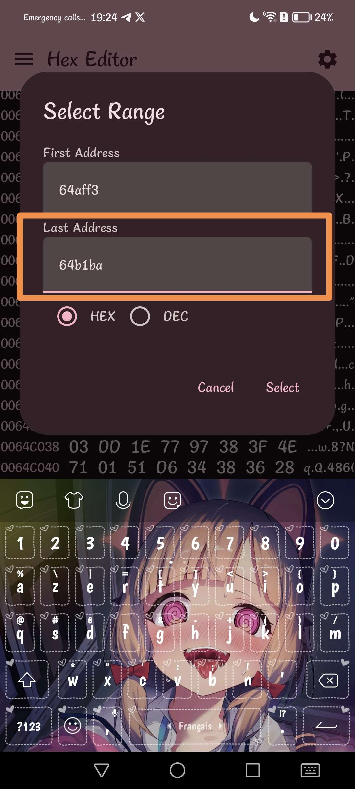

# !!!!! Read the steps carefully and do not necessarily trust everything that is on the image, whether the name of the pak or the offsets. !!!!
## Step 1)
Download [Files](https://play.google.com/store/apps/details?id=com.marc.files) 
- follow this [video](https://youtu.be/8N6MFhZ8XlY?si=ULY7uNq79dFiOSix)
- path pak : Android > data > com.epicgames.fortnite > files > InstalledBundles > GFP_BaseInstallRoot > Content > Paks > pakchunk30-Android_ASTCClient.ucas

## Step 2)
Download [Hex Editor](https://play.google.com/store/apps/details?id=tk.yunus.hexeditor&pcampaignid=web_share)
- go 'Open or Create File' > 'Open File' and select ```pakchunk30-Android_ASTCClient.ucas```


## Step 3) Orange Copy:
- go 'Select Range' > First Address: ```69184A0``` > Last Address: ```6918A09``` and Select


## Step 4)
- copy code hex: 

```
8C 06 00 05 63 88 05 61 00 00 00 00 B8 0A 00 00 50 10 48 03 77 82 81 F0 20 00 00 00 22 00 80 DB 0C 20 0A 48 90 A0 B4 B4 21 00 7C 08 64 C1 00 00 00 00 30 14 4A EA 88 59 6C 1E 49 09 63 15 20 35 E0 09 2D A0 1F 76 01 AB C3 79 53 F2 D4 7A D0 32 1D BA B0 E5 63 3B 03 45 12 AD B0 68 C1 E5 7B 0B 62 98 67 C7 CB 73 78 2B B9 2C 83 6C 9B 9C D3 AC 8F 09 E1 55 C2 03 DD 1E 77 97 38 3F 4E 71 01 51 D6 34 38 36 28 AB 36 8F E8 94 7E 64 CD 44 DB B0 82 9C F5 0B 58 AF 30 FE F7 9A 5D 05 79 4F 32 C6 04 7A 8F D2 E2 2C 47 96 64 46 BB A7 87 8D F3 2B 3B D9 86 48 CF F8 C0 7E A2 47 CD F9 91 AC F4 14 14 FF A5 EF FF B4 9D C3 62 3E C1 62 D4 5D B4 64 A1 3A 0D 7F FD E4 FF 4D D0 B6 8F 4F 45 0F C8 40 A6 4C 87 54 4E DD 1B 08 A7 82 8D 3B 5D EC 88 E3 79 80 89 94 8D 17 E5 08 1C 0D 9E F0 D2 87 A5 9A CE C2 08 1F 44 A3 25 7D 41 AC 55 5C F8 3F 93 13 1C EF C1 B9 48 21 AD 6A 2E AC 60 80 63 80 97 E8 38 79 43 2E C7 07 76 17 07 8C F1 E3 E9 AF 69 AF 06 C4 CB A4 AC 41 BC BE 28 26 00 55 00 2F 00 32 00 4F 00 2C 00 3E 00 4A 00 67 00 72 00 52 00 4C 00 59 00 5C 00 4E 00 52 00 52 00 47 00 57 00 52 00 50 00 48 00 33 00 14 00 34 00 30 00 21 00 29 00 28 00 26 00 36 00 06 00 21 00 7D 06 ED D1 7B 98 29 4A E2 71 0D ED D9 85 24 6B 22 58 22 09 7C DC D3 CE AC 51 E3 22 58 A5 6D 55 F8 70 6A 8A 1E 92 E4 EA E2 71 3C 02 1F 00 FF FF FF FF FF FF FF FF A0 B0 38 5B 65 3D F1 8C 0B 01 00 03 FB 1E 19 03 15 01 16 05 14 02 00 09 1A 06 17 07 13 13 06 08 12 0A 10 0B 0E 0C 0F 0D 09 0E 0A 0F 0D 10 11 11 0C 12 0B 04 05 14 08 15 1C 16 04 17 18 18 1D 19 03 1A 07 1B 00 1C 01 1D 1B 1E 00 00 00 00 03 02 00 00 00 00 00 00 00 A2 B5 75 93 34 4A 4A BB AA EE B5 25 CA A8 DA FC 93 21 24 66 DD C3 C7 00 9C 35 12 D4 07 BC A4 A0 00 71 00 71 AA AD 52 59 27 EB 93 E6 44 92 86 34 CD F1 01 3A E5 77 23 14 89 DE 21 14 31 87 A5 67 3B BD 54 12 AD 24 A9 43 7C 28 6A 2E 42 34 F1 A4 5E F5 7A 74 CB A3 EE 3D E4 8D EA B7 07 A7 43 39 F8 1A 99 87 DF 7C 84 78 96 5D 1D F0 93 53 8D 4B E8 3F CA 9A AD CC 1A A2 B9 0A 94 20 52 09 B2 96 D5 19 3B A1 A3 43 75 40 8F E7 F3 92 3B 9D F5 2F 2A AA DC 18 D4 CC 77 A0 4E 63 A7 97 2F 70 88 9B 2A 86 A9 BF B7 E0 BD 8D 4F 43 A9 95 39 D0 43 AB 5A 0A 9A F9 B5 1C 10 E2 8D C4 16 EF C1 F5 8F 6C C0 6F CB 96 E6 8B 52 D0 B5 0E BC CA 2B 4B 86 25 0D EA 68 F3 35 3D 92 20 28 A5 D5 CE 3F 3E 6F 14 16 D9 05 D2 AD 8E 50 1F A6 B2 75 1F 5C 5E 38 2C 19 D6 F2 E8 FB 1B 1F B3 7C 96 7D 9D A5 42 D1 52 C6 1E FF DD F2 1B 1E 44 D8 5B 4F 38 F4 CF CF 21 B8 FD E9 55 99 26 37 33 6A A6 86 CB 1F 47 9D A2 BB 61 07 1A 39 1A 6B E8 4D 24 7D 9D 4D 50 F7 82 96 81 49 A7 E4 ED 20 1C B3 E9 69 92 C4 13 A5 32 73 BC 71 CE E5 4F 07 C0 D1 05 CC DD B9 E6 6C 48 B0 BC B8 3E 64 D5 72 ED AF AF CA 03 80 F0 0C BF FA AD 8C 26 5A B3 90 83 86 C0 76 38 75 F3 5E 85 ED DD 7A 39 2E 39 6F 83 04 80 80 04 81 92 71 00 64 18 80 11 00 00 E9 05 02 03 C9 01 45 05 05 05 05 02 CA D3 FD DF 35 D4 D7 E0 39 D4 FB CC C9 38 D4 D7 D8 31 C8 13 DD 07 38 D4 38 D4 02 C6 D0 C8 D4 38 CC DF EC 38 E4 F7 38 CE EB CF DB D4 E0 38 F8 D3 CF C8 D3 CD 38 FC CB E0 35 C8 38 E0 CF DC DB 38 FC D7 AB 19 38 F4 EB D0 CC F4 F8 D4 DC CF E0 D4 FB FD 03 78 78 38 C8 E4 FB FC C8 DB DB 38 F8 DD DF D4 FC F9 DC 38 F4 F8 C7 38 D4 D4 EF CB 38 CB D9 EF D8 CF FC EC C4 FF EF 38 C8 CC 38 C8 D0 EB 38 EF D7 DC D8 EB DC CC D3 D4 E5 D0 C8 E5 D4 CA CD CB FC FC D9 EC DB 52 12 DB D8 D8 C7 38 B5 29 C6 D8 DD 89 D4 0D 25 0D 25 0D 25 39 0E 25 0D 25 0D 25 0D 25 0D 25 0D 25 0D 25 0D 25 0D 25 0D 25 0D 25 0D 25 0D 25 0D 25 0D 25 0D 25 0D 25 0D 25 0D 25 0D 25 0D 25 0D 25 0D 25 0D 25 0D 25 80 80 81 0E 15 16 10 0C 15 16 0C 16 12 25 0E 1A 20 0B 15 0E 18 1D 11 22 19 10 1A 2E 2E 16 12 1B 10 20 0F 1F 11 1F 0A 1C 08 15 0F 1B 19 0C 1A 2B 22 0B 10 1C 12 1C 2E 29 24 2A 0D 1A 33 31 23 0B 0D 1B 29 22 0C 19 08 12 10 1B 38 10 38 38 0C 1B 38 0C 0E 1B 32 37 0E 1B 28 13 0A 2B 19 30 1B 17 16 2E 12 0A 34 14 25 15 0E 13 14 10 1D 3C 1C 38 13 15 30 0F 38 1E 34 1C 20 42 08 16 1A 0C 1B 20 19 1E 0F 0D 00 00 38 03 FF 09 13 06 1B 04 08 09 09 05 1C 05 06 0A 01 04 11 09 06 09 12 04 03 06 06 0F 21 0B 05 18 01 03 02 01 02 01 12 0F 06 04 0C 04 19 03 04 07 0B 0B 29 02 01 10 25 05 06 22 AF 34 81 22 CB 49 C1 9A DE EA 8F 9C CC 83 7F 52 82 34 A7 28 FB 61 41 11 80 30 A0 2A B0 D0 70 0F 83 6F 3F 82 81 CE 5E 3A 02 EA 8E 33 20 89 98 FB 4F
```


## Step 5)
- go 'Edit' > 'Overwrite' > paste code hex and Apply


## Step 6) White Copy
- go 'Select Range' > First Address: ```691812D``` > Last Address: ```691826D``` and Select





## Step 7)
- go 'Edit' > 'Fill Overwrite' > Don't change anything and Apply


## Step 8) Optionnal (Necessary for DeleteCopy)
- go 'Select Range' > First Address: ```691B316``` > Last Address: ```691B437``` and Select


## Step 9)
- go 'Edit' > 'Fill Overwrite' > Don't change anything and Apply


## Step 10) Optionnal (Necessary for DeleteCopy)
- go 'Select Range' > First Address: ```6912FA5``` > Last Address: ```6913115``` and Select


## Step 11)
- go 'Edit' > 'Fill Overwrite' > Don't change anything and Apply


## Step 12)
- go to the top left and press the last save icon


