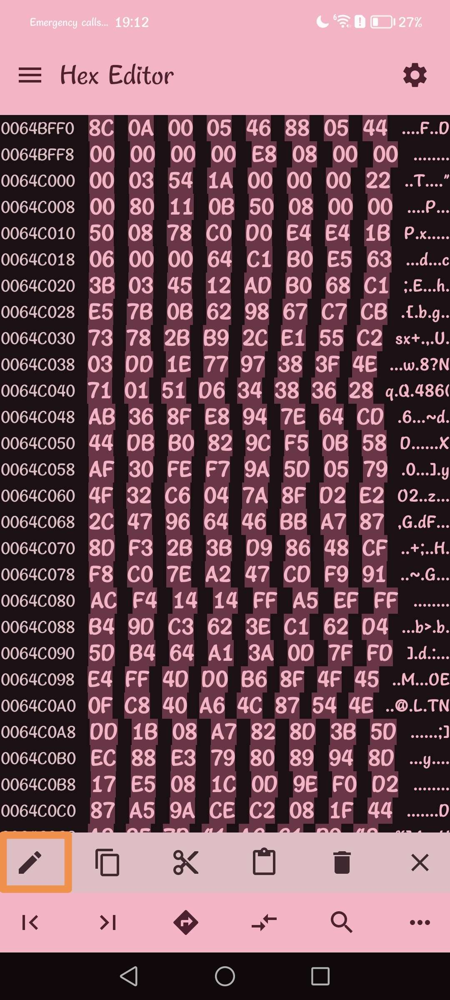

# !!!!! Read the steps carefully and do not necessarily trust everything that is on the image, whether the name of the pak or the offsets. !!!!
## Step 1)
Download [Files](https://play.google.com/store/apps/details?id=com.marc.files) 
- follow this [video](https://youtu.be/8N6MFhZ8XlY?si=ULY7uNq79dFiOSix)
- path pak : Android > data > com.epicgames.fortnite > files > InstalledBundles > GFP_BaseInstallRoot > Content > Paks > pakchunk30-Android_ASTCClient.ucas

## Step 2)
Download [Hex Editor](https://play.google.com/store/apps/details?id=tk.yunus.hexeditor)
- go 'Open or Create File' > 'Open File' and select ```pakchunk30-Android_ASTCClient.ucas```


## Step 3)
- go 'Select Range' > First Address: ```89D3B00``` > Last Address: ```89D4092``` and Select


## Step 4)
- copy code hex: 

```
8C 06 00 05 8C 88 05 8A 00 00 00 00 00 0B 00 00 50 10 B4 03 91 82 82 02 21 00 00 22 00 80 39 0D 00 00 68 0A 00 00 68 0A 90 D8 E8 FC FC D8 22 00 B7 08 64 C1 00 00 00 00 30 14 4A EA 88 59 6C 1E 49 09 63 15 20 35 E0 09 2D A0 1F 76 01 AB C3 79 53 F2 D4 7A D0 32 1D BA EE 4B 70 F0 85 52 33 3E B0 E5 63 3B 03 45 12 AD B0 68 C1 E5 7B 0B 62 98 67 C7 CB 73 78 2B B9 2C 83 6C 9B 9C D3 AC 8F 09 E1 55 C2 03 DD 1E 77 97 38 3F 4E 71 01 51 D6 34 38 36 28 AB 36 8F E8 94 7E 64 CD 44 DB B0 82 9C F5 0B 58 AF 30 FE F7 9A 5D 05 79 4F 32 C6 04 7A 8F D2 E2 2C 47 96 64 46 BB A7 87 8D F3 2B 3B D9 86 48 CF F8 C0 7E A2 47 CD F9 91 AC F4 14 14 FF A5 EF FF B4 9D C3 62 3E C1 62 D4 5D B4 64 A1 3A 0D 7F FD E4 FF 4D D0 B6 8F 4F 45 0F C8 40 A6 4C 87 54 4E DD 1B 08 A7 82 8D 3B 5D EC 88 E3 79 80 89 94 8D 17 E5 08 1C 0D 9E F0 D2 87 A5 9A CE C2 08 1F 44 A3 25 7D 41 AC 55 5C F8 3F 93 13 1C EF C1 B9 48 21 AD 6A 2E AC 60 80 63 80 97 E8 38 79 43 2E C7 07 76 17 07 8C D1 54 98 99 92 A8 CE 74 F8 B4 73 7E 03 12 1B E1 00 55 00 2F 00 32 00 4F 00 3E 00 2C 00 3E 00 4A 00 67 00 72 00 52 00 4C 00 59 00 5C 00 4E 00 52 00 52 00 47 00 57 00 52 00 50 00 48 00 33 00 14 00 34 00 30 00 21 00 29 00 28 00 26 00 36 00 06 00 20 00 7B 01 ED D1 7B 98 29 4A E2 71 0D ED D9 85 24 6B 22 58 22 09 7C DC D3 CE AC 51 E3 22 58 A5 6D 55 F8 70 6A 8A 1E 92 E4 EA E2 71 4E 02 20 00 FF FF FF FF FF FF FF FF E9 B3 38 68 E9 10 B7 B9 0B 01 00 03 FB 1F 1A 03 16 01 17 05 15 02 00 09 1B 06 18 07 14 13 07 08 13 0A 11 0B 0F 0C 10 0D 0A 0E 0B 0F 0E 10 12 11 0D 12 0C 04 06 14 09 15 1D 16 05 17 19 18 1E 19 03 1A 08 1B 00 1C 01 1D 1C 1E 02 1F 00 00 00 00 03 04 00 00 00 00 00 00 00 A2 B9 7D 93 34 4A 4A BB AA FE D4 93 92 A4 6D 7E 91 88 49 19 B7 70 F1 C0 27 0D C4 B5 01 EF 29 28 00 74 00 71 AA AD 52 D9 26 EB 93 E6 44 92 86 34 CD 71 05 5D F2 AB 11 8A 44 EF 10 A0 A3 FD CD 81 56 AD 6A 29 68 E6 E7 72 42 88 37 12 5B BC 07 FF 91 1D F8 65 D9 D3 FC A5 14 74 AB 03 6F F2 CC 92 61 49 83 3A DA 7C 4D 6B 12 CF 72 A8 03 7E 72 AA 71 09 FD 7B D9 B2 95 59 43 34 57 81 12 44 86 4A 90 AD 6C CE 38 08 9D 1D AA 03 7A 3C 1E 5F B9 D3 59 F7 78 83 4D 14 01 D4 CC 0F A0 4E 63 A7 5F DF E0 10 77 55 0C 53 7F 6F C1 7B 1B 1F 86 52 EB 9A 67 0E 45 C0 03 4E 28 BF BE F7 CB 55 93 F9 E0 F2 C4 22 B1 59 6E 37 73 41 34 F0 C9 53 B9 73 1C EF 9C 4C E9 02 B1 64 5A FA 2C 27 48 BB 28 A5 CD 3E 7F 7C DC 28 2C 72 08 A4 7B 1D A1 3E 4C 65 EF 3E B8 3C 71 90 25 C3 5A 1E FD 78 E3 73 96 8F 72 AC B3 54 28 5A CA 38 02 F5 9F CB 8D 01 0A C1 7A 73 F9 6A D2 3F 3C 8E F3 D7 A5 56 64 98 DC CD AA 9A 3B 2C 7D 1C FB 68 57 6C 20 E3 47 23 4D 7D 09 A4 F7 B3 A9 AA 1E F0 52 D0 29 32 E3 3E 6F C3 CC 8B 7C 9C A9 D3 83 DF FA A7 79 0F 47 A8 F2 DD 9E BD 57 A9 3C 4D 10 B9 A8 AA E2 1D 49 25 68 92 A9 E5 DA 3D 2C 39 B3 01 59 9B FA AD 8C 26 5A B3 90 83 8E C0 77 38 75 F3 9E 85 1C 3D 7A 39 2E 39 EF 83 04 80 80 04 81 92 71 00 74 1C 00 16 00 00 F2 09 01 03 05 05 05 05 D5 05 02 CA D3 FD DF 35 D4 D7 E0 39 D4 FB CC D5 2C D4 D7 B0 09 38 D4 DF D4 2D CC 13 DD 07 38 D4 38 D4 02 C6 D0 C8 D4 38 CC DF EC 38 E4 F7 38 CE CB E4 CF DB D4 E0 38 F8 D3 CF C8 D3 CD 38 FC CB E0 35 D4 2C E0 CF DC DB 38 FC D7 AB 19 38 F4 EB D0 CC F4 F8 D4 DC CF E0 D4 CB F8 FD 03 78 78 38 C8 E4 FB FC C8 DB DB 38 F8 DD DF D4 FC F9 DC 38 F4 F8 D3 2C D4 D4 EF CB 38 CB D9 EF D8 CF F8 2C EC FF EF 38 C8 CC 38 C8 D0 EB 38 EF D7 DC D8 EB DC CC D3 D3 D4 E5 CB E5 D4 CA CD CB F8 F9 38 D9 D8 DB 52 12 DB D8 D8 FB 44 B5 29 C6 D8 DD 89 D4 0D 25 0D 25 0D 25 39 0E 25 0D 25 0D 25 0D 25 0D 25 0D 25 0D 25 0D 25 0D 25 0D 25 0D 25 0D 25 0D 25 0D 25 0D 25 0D 25 0D 25 0D 25 0D 25 0D 25 0D 25 0D 25 0D 25 0D 25 0D 25 0D 25 80 80 84 0C 17 16 10 0C 15 16 0C 16 12 25 0E 1A 20 18 18 0B 15 0E 18 1D 11 26 19 10 1A 2F 30 16 12 1B 09 10 20 0F 1F 11 1F 0A 1C 08 15 0F 1B 19 0C 1A 2B 22 0B 10 1C 12 1C 2E 29 24 2A 0D 1A 33 31 23 0B 30 0D 1B 29 22 0C 19 08 12 10 1B 38 10 38 38 0C 1B 38 0C 0E 1B 32 37 0E 1B 28 13 0A 2B 19 30 17 16 2E 12 0A 34 14 25 15 0E 13 14 10 1D 33 3C 1C 38 15 30 0F 38 1E 34 1C 20 42 08 16 1A 0C 1B 20 19 1E 0F 0D 00 00 38 0B FF 09 13 06 1B 0A 03 08 09 09 05 19 05 06 0A 01 04 11 09 06 09 12 04 03 06 06 0B 21 0B 05 18 01 03 02 01 02 01 12 0F 06 04 07 19 03 04 07 0B 0B 1D 02 03 02 25 05 06 22 AF A6 57 A4 0C E3 BA 80 8E 8A 8F 9C CC 83 7F 52 81 87 B8 70 88 1B EA 18 0C 65 00 80 02 57 52 55 28 8D BC FD 08 06 3A 7B A9 7B 6B 06 27 2D 4B 0E 11 83 FE 4F
```


## Step 5)
- go 'Edit' > 'Overwrite' > paste code hex and Apply




## Step 6)
- go 'Select Range' > First Address: ```89AE45F``` > Last Address: ```89AE594``` and Select


## Step 7)
- go 'Edit' > 'Fill Overwrite' > Don't change anything and Apply


## Step 8)
- go to the top left and press the last save icon


