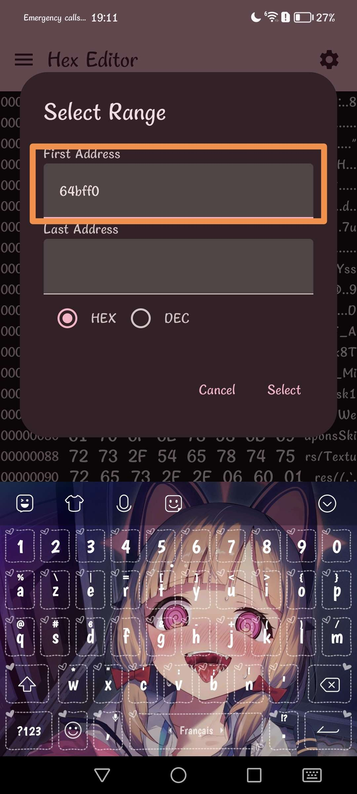
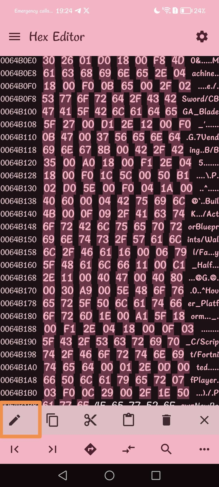

# !!!!! Read the steps carefully and do not necessarily trust everything that is on the image, whether the name of the pak or the offsets. !!!!
## Step 1)
Download [Files](https://play.google.com/store/apps/details?id=com.marc.files) 
- follow this [video](https://youtu.be/8N6MFhZ8XlY?si=ULY7uNq79dFiOSix)
- path pak : Android > data > com.epicgames.fortnite > files > InstalledBundles > GFP_BaseInstallRoot > Content > Paks > pakchunk30-Android_ASTCClient.ucas

## Step 2)
Download [Hex Editor](https://play.google.com/store/apps/details?id=tk.yunus.hexeditor)
- go 'Open or Create File' > 'Open File' and select ```pakchunk30-Android_ASTCClient.ucas```


## Step 3)
- go 'Select Range' > First Address: ```8D9FD30``` > Last Address: ```8DA02A2``` and Select





## Step 4)
- copy code hex: 

```
8C 06 00 05 6C 88 05 6A 00 00 00 00 B8 0A 00 00 50 10 6C 03 7E 82 81 F1 20 00 00 00 22 00 80 F2 0C 20 0A 48 90 A0 B4 B4 90 21 00 79 08 64 C1 00 00 00 00 30 14 4A EA 88 59 6C 1E 49 09 63 15 20 35 E0 09 2D A0 1F 76 01 AB C3 79 53 F2 D4 7A D0 32 1D BA B0 E5 63 3B 03 45 12 AD B0 68 C1 E5 7B 0B 62 98 67 C7 CB 73 78 2B B9 2C 83 6C 9B 9C D3 AC 8F 09 E1 55 C2 03 DD 1E 77 97 38 3F 4E 71 01 51 D6 34 38 36 28 AB 36 8F E8 94 7E 64 CD 44 DB B0 82 9C F5 0B 58 AF 30 FE F7 9A 5D 05 79 4F 32 C6 04 7A 8F D2 E2 2C 47 96 64 46 BB A7 87 8D F3 2B 3B D9 86 48 CF F8 C0 7E A2 47 CD F9 91 AC F4 14 14 FF A5 EF FF B4 9D C3 62 3E C1 62 D4 5D B4 64 A1 3A 0D 7F FD E4 FF 4D D0 B6 8F 4F 45 0F C8 40 A6 4C 87 54 4E DD 1B 08 A7 82 8D 3B 5D EC 88 E3 79 80 89 94 8D 17 E5 08 1C 0D 9E F0 D2 87 A5 9A CE C2 08 1F 44 A3 25 7D 41 AC 55 5C F8 3F 93 13 1C EF C1 B9 48 21 AD 6A 2E AC 60 80 63 80 97 E8 38 79 43 2E C7 07 76 17 07 8C D1 54 98 99 92 A8 CE 74 F8 B4 73 7E 03 12 1B E1 00 55 00 2F 00 32 00 4F 00 2C 00 3E 00 4A 00 67 00 72 00 52 00 4C 00 59 00 5C 00 4E 00 52 00 52 00 47 00 57 00 52 00 50 00 48 00 26 00 21 00 34 00 30 00 14 00 36 00 28 00 26 00 36 00 06 00 20 00 7B 01 ED D1 7B 98 29 4A E2 71 0D ED D9 85 24 6B 22 58 22 09 7C DC D3 CE AC 51 E3 22 58 A5 6D 55 F8 70 6A 8A 1E 92 E4 EA E2 71 3C 02 1F 00 FF FF FF FF FF FF FF FF E9 B3 38 68 E9 10 B7 B9 0B 01 00 03 FB 1E 19 03 15 01 16 05 14 02 00 09 1A 06 17 07 13 13 06 08 12 0A 10 0B 0E 0C 0F 0D 09 0E 0A 0F 0D 10 11 11 0C 12 0B 04 05 14 08 15 1C 16 04 17 18 18 1D 19 03 1A 07 1B 00 1C 01 1D 1B 1E 00 00 00 00 03 02 00 00 00 00 00 00 00 A2 BD 7B 93 34 4A 4A BB A9 77 5A 92 72 54 8D AF C9 32 12 46 6D DC 3C 78 09 C3 71 2D 40 7B CA 4A 00 73 00 71 AE AD 52 D9 66 EB 93 E6 44 92 86 34 2F F1 0E 3A E7 57 23 14 89 DE 21 14 31 87 A5 47 3B 3F 55 12 AD 24 A9 43 BC 2B 6A 2E 42 34 F3 AC 5E F5 72 72 CB 93 1E 3C E4 51 F5 DB 83 D3 B1 1C 7D 8B CC C3 6F 3E 41 3C CB BE 0E F8 C9 A9 C6 35 F4 6F 65 CB 56 16 0D D1 5C 05 4A 40 25 C8 76 41 CB 93 1F AE 7C CA F2 5E 0E 75 91 0A 45 4B 19 07 A0 FE 77 B9 72 05 D4 CC F7 A0 4E 63 A7 9F 5F E0 10 C7 2A 86 B9 BF B5 E0 BD 4D 0F 43 A9 95 39 D0 5D AB 5A 0A 9A F9 B9 1C 11 E2 95 C4 56 EF C1 F5 8F 8C E0 97 75 47 CB A7 52 D0 AD 0E BC C9 33 4B 86 25 0D EA 68 CB 25 DD 93 20 28 A5 CD 3E 7E BC 5F 29 AC B2 0F A4 3B 9D A0 3E CC 65 E7 3E B8 8C BA 66 98 C8 54 46 9A AB 2D DC 98 64 51 A5 D7 D3 48 9E 1F E9 6E F9 63 7E C1 DD 22 01 1A 4C D8 5F C3 BA 2E 9D CC F8 F1 E3 D0 1D 50 E4 E8 5E C6 73 65 0E 27 F2 63 ED CD B0 83 8D 1C 4D 35 F4 26 92 DE CE A6 A8 7B C1 4B 40 AC F3 F6 76 90 8E 59 F4 B4 C9 62 19 D2 99 38 DD 38 E3 72 A7 A3 E0 68 82 E6 AE DC F3 36 24 58 9E 5C 1F 32 68 BD 6E D7 D7 E5 11 C0 78 06 5F FD 56 A6 13 2D 59 C8 41 C8 C0 75 38 65 F3 9E 84 1F DD 7A 39 AE 38 EF 83 04 80 80 04 81 92 71 00 65 18 80 15 00 00 EB 05 02 03 C9 01 45 05 05 05 05 55 02 CA D3 FD DF 35 D4 D7 E0 39 D4 FB CC C9 38 D4 D7 D8 31 C8 13 DD 07 38 D4 38 D4 02 C6 D0 C8 D4 38 CC DF EC 38 E4 F7 38 CE EB CF DB D4 E0 38 F8 D3 CF C8 D3 CD 38 FC CB E0 35 C8 38 E0 CF DC DB 38 FC D7 AB 19 38 F4 EB D0 CC F4 F8 D4 DC CF E0 D4 FB FD 03 78 78 38 C8 E4 FB FC C8 DB DB 38 F8 DD DF D4 FC F9 DC 38 F4 F8 C7 38 D4 D4 EF CB 38 CB D9 EF 38 EF 38 EC C4 FF DB CF 5C C8 FC C8 D0 EB 38 CF D8 D7 DC D8 EB DC CC D3 D3 D4 E5 CB E5 D4 CA CD FB F9 38 D9 D8 DB 52 12 DB D8 D8 FB 44 B5 29 C6 D8 DD 89 D4 0D 25 0D 25 0D 25 39 0E 25 0D 25 0D 25 0D 25 0D 25 0D 25 0D 25 0D 25 0D 25 0D 25 0D 25 0D 25 0D 25 0D 25 0D 25 0D 25 0D 25 0D 25 0D 25 0D 25 0D 25 0D 25 0D 25 0D 25 0D 25 80 80 80 0E 17 16 10 0C 15 16 0C 16 12 25 0E 1A 20 0B 15 0E 18 1D 11 22 19 10 1A 2E 2E 16 12 1B 10 20 0F 1F 11 1F 0A 1C 08 15 0F 1B 19 0C 1A 2B 22 0B 10 1C 12 1C 2E 29 24 2A 0D 1A 33 31 23 0B 0D 1B 29 22 0C 19 08 12 10 1B 38 10 38 38 0C 1B 38 0C 0E 1B 32 37 0E 1B 28 13 12 30 1B 17 16 10 2E 1B 0A 34 14 1C 14 15 0E 13 14 10 1D 33 3C 1C 38 15 30 0F 38 1E 1C 20 42 08 16 1A 0C 1B 20 19 1E 0F 0D 00 00 39 03 FF 09 13 06 1B 04 08 09 09 05 1C 05 06 0A 01 04 11 09 06 09 12 04 03 06 06 0F 21 0B 05 18 01 03 02 01 02 01 12 0F 06 01 04 19 03 04 04 04 07 0B 0B 1D 02 03 06 25 05 06 22 AF 34 81 22 CB 49 C1 9A DE EA 8F 9C CC 83 7F 50 46 1C 50 AA A3 01 8C 00 40 81 07 7D 03 11 0E A7 11 66 3F 82 81 CE 5E 3A 02 EA 8E 33 20 89 98 FB 4F
```


## Step 5)
- go 'Edit' > 'Overwrite' > paste code hex and Apply


## Step 6)
- go 'Select Range' > First Address: ```8D7265F``` > Last Address: ```8D72794``` and Select


## Step 7)
- go 'Edit' > 'Fill Overwrite' > Don't change anything and Apply




## Step 8)
- go to the top left and press the last save icon


